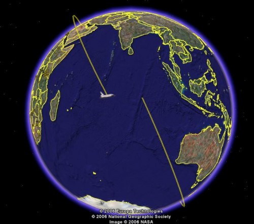

Végre kilőtték. A Google Earth-ös tracker per pill ilyet mutat:

Az űrállomás a felvétel időpontjában épp Florida fölött húzott el (innen indult az űrsikló), tehát egy félgömbnyivel van előbbre az űrsiklónál. Most az történik, hogy az űrsikló kisebb pályamódosítások után bekerül az űrállomás keringési síkjára. De egy kicsit alacsonyabban fog repülni, mint az ISS, így egy kicsit gyorsabb lesz az űrállomásnál, és kb. két nap alatt ledolgozza a hátányt.

Egyébként egész pontos adataim vannak a repülésről. Az előbb a NASA tv-n beadták az irányítóközpont képét, és csak kb. 2 fokkal voltam mellette a pontos helyzetnek. (Per pill ez az egyetlen hely van, ahonnan pontos adatokat tudok nyerni, mert a netes cuccokon csak az ISS helyzetét lehet megtalálni.) Meg egyébként is: az irányítóközpontban biztos tudják hol van...
