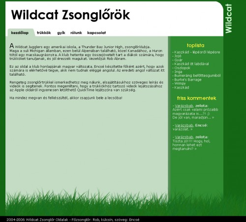

Újratervezem a Wildcat oldalt. Valami ilyesmi lesz, persze még sokat fog változni. A színekkel heteket szoktam szenvedni, mert színtévesztő lévén sose tudom, hogy mi néz ki igazán jól. Ráadásul nem mindegy az se, hogy milyen monitoron nézi az ember. Majd a tesómmal egyeztetünk, ha egyszer haza téved.

A főbb változtatások között szerepel, hogy minden oldalon lesz egy új sáv a jobboldalon. Ez igazából nagyon hiányzik a mostani designból. Tulajdonképpen ezért is tervezem újra. A fő-fő probléma az volt eddig, hogy bár lehetett kommentezni minden trükköt, nem igazán látszott, hogy milyen hozzászólások voltak az elmúlt pár napban. Ez a kis jobboldali sáv ezt remekül megoldja, így sokkal pörgösebb lesz a közösségi élet. (Remélhetőleg.)

Ha már van jobboldali sáv, mindenféle ajánlót is tehetek rá (toplista, új trükkök stb.)

Másik lényeges pont, hogy a főablak (balra) sötét alapon világosról átvált világos alapon sötétre. Így jobban olvasható, kevésbe fárasztja a szemet. Ezzel ellentétesen hat, hogy a betűtípust talpatlanra cserélem, de most ez tetszik. Bocs.

Nem lebecsülendő az sem, hogy az új tárhelyen lesz php+mysql is, így egy csomó új trükköt bevethetek. Pl. a kommentek nem külön ablakban nyílnak majd meg, hanem szépen a trükkleírások alatt, ahogy kell. Nincs többé javascriptes szívás, se haloscan se semmi.
