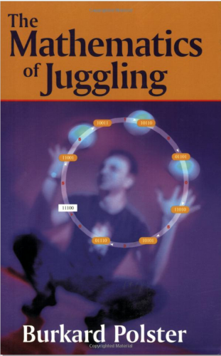

Valakitől kaptam egy emailt, hogy tudnék-e ajánlani valamit a fenti témában. A helyzet az, hogy ez engem is nagyon érdekelne, de olyan sok anyagom nincs róla. Van egy egyetemi előadás [A zsonglőrködés matematikája](http://www.math.u-szeged.hu/tagok/czedli/oktatas/zs-mat.htm) címmel, de sajnos nincs online jegyzetük, ráadásul a szegedi egyetemen tartják, ami, mit ne mondjak, enyhén szólva kiesik a közvetlen környezetemből.

Aztán van még egy könyv is [The Mathematics of Juggling](http://www.amazon.com/Mathematics-Juggling-Burkard-Polster/dp/0387955135), de könyvesboltban eddig még nem láttam (amazontól meg nem rendelek). Talán valamelyik könyvtárban megtalálható.

Sokszor kapok levelet vagy hozzászólást arról, hogy milyen a 'négy labdás kaszkád'. Úgy tűnik, három labdával mindenki tud [kaszkádolni](http://zsonglor.csokavar.hu/tricks/ball3Cascade.php), na de néggyel?

A neten találtam egy, már a címében is ígéretesnek tűnő, cikket: [Why men (and octopuses) cannot juggle a four ball cascade](http://www.win.tue.nl/~sjouke/misc/jugglepaper.html). Teljesen érthető, és könnyen emészthető olvasmány akár gimnazistáknak is. Egyedül a Kínai maradéktétel húzós benne, de azt tulajdonképpen el lehet hinni bizonyítás nélkül is (progmatosok meg már úgyis elsőben megtanulják).

A cikkből kiderül, hogy a négy labdás kaszkád (legalábbis az írók által definiált értelemben) nem lehetséges. Fő eredményük az, hogy kaszkádban csak akkor lehet zsonglőrködni, ha a rendelkezésünkre álló kezek és labdák száma egymással relatív prím. Mivel kettőnél több keze legfeljebb a polipnak vagy két zsönglőrnek együtt van, a tétel a gyakorlatban annyit tesz, hogy egy zsonglőrnél csak páratlan számú labda jöhet szóba, tehát marad a 3,5,7,9,11. Páros mintákhoz ott van a [szökőkút](http://zsonglor.csokavar.hu/tricks/ball4FountainSynchronous.php), és hasonlók.

### Kiegészítés

A kaszkádos cikket időközben [lefordítottam](http://zsonglor.csokavar.hu/numbers/cascade/).
