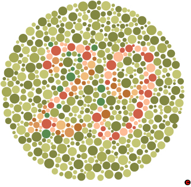

Az előbb ránéztem az elemtöltőre, és erről eszembe jutott, hogy durván színtévesztő vagyok. Ez az élmények és a szórakozás kimeríthetetlen tárháza. Néhány pillanatot megosztok önökkel is:

1\. a színtévesztő teszt harmadik oldalánál már nagyon szoktam röhögni. Ez egészen a végéig egyre csak fokozódik.  2. nem látom a különbséget a közlekedési jelzőlámpa pirosa és sárgája között.

3\. egyszer fél órán keresztül debuggoltam, hogy miért nem rózsaszín egy felirat a mi csodálatos szoftverünkben. Végső elkeseredésemben előkaptam photoshopot, és megnéztem, hogy milyen színű is az a felirat. Csak ekkor bizonyosodott be, hogy mégis rózsaszín, nem szürke.

4\. valaki pirossal és zölddel különböztetett meg valamit a fent említett termékben, és fél év után jöttem rá, hogy ha az egyiket félkövérrel szednénk, akkor még én (meg Maya) is látnánk a különbséget a kettő között.

5\. a kurva elemtöltőben elemenként egyetlen LED van. Ez zöld színnel világít, ha az elem fel van töltve, pirossal, ha töltődik. Nálam az ellenőrzés a következő algoritmussal történik.

- Beteszek egy elemet a többi mellé, amiről biztosan tudom, hogy nincs feltöltve.
- Hunyorítok, a szemem sarkából nézem vagy oldalra fordítom a töltőt, és kis szerencsével észreveszem, hogy az elvileg feltöltött elemeknél kicsit más színnel világít a lámpa. (Persze sose tudhatom, hogy rosszul látok, vagy tényleg nincs még feltöltve a cucc.)
- előkotrom a piros-kék 3D szemüveget, és azzal próbálom az előző pontot.
- felbaszom az agyam, és megkérek valakit, hogy nézzen rá a töltőre.
- \[egyszer még feldarabolom azt a barmot, aki feltalálta a piros-zöld LED-et.\]

Valahogy így :)

### Kapcsolódó linkek

[http://www.colblindor.com/](http://www.colblindor.com/) [http://www.vischeck.com/](http://www.vischeck.com/)
