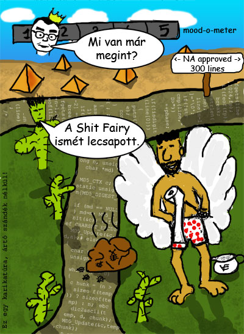

Ennél találóbb cím nem jutott az eszembe. Sokat filóztam, hogy feltegyem-e ezt ide, mert az ISC-n kívül semmi értelme nincs, de azért mégis felteszem, mert ez az én blogom, ahol azt csinálok ami nekem tetszik.

András küldött egy comicot arról, hogy a programozók legfőbb kifogása a nemdolgozásra az, hogy éppen fordít a gépük. Ez nálunk is igaz, hiszen egy full rebuild eltart legalább öt percig, közben pedig a gép gyakorlatilag merevre fagy. (Persze már kaptunk három Core 2-es gépet, amivel minden nagyon jó lett, de még vannak kollégák régi gépekkel.)

Már kb. egy éve töröm a fejem egy intentional comic sorozaton, mert az ottani, jó értelemben vett, kreténséget igazából csak rajzban lehet visszaadni. (Kár, hogy nem tudok eléggé rajzolni.) Most viszont nagyon ráértem délután, és a Bandi-féle levél remek apropót kínált az alábbi kis firkálmány elkészítéséhez:

 Elmagyarázni nem fogom.

Diszklémer hegyek (a kép metadatájából):

Mielőtt bárkinek kétségei támadnak: a bilin _nem_ az ISC logója látható. Sit Feri fiktív személy, igazából arca sincs, ki is kellett volna takarni. A felhasznált kódrészlet nem az Intentional Software Corp. tulajdona, hanem Google CodeSearch-el kerestem.

Csak még egy apróság: a hitelesség kedvéért Cactus színét a [faviconjából](http://cactus.rulez.org/favicon.ico) vettem.
