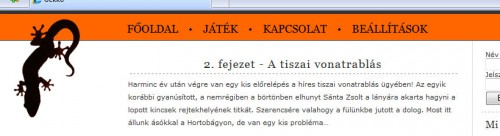

Kurvára hasongat a fejem. Az egész kibaszott napomat bearanyozta.

Mostanság megint sokat gondolkozom a Soha El Nem Készülő Geek Játékon. Pillanatnyilag a tervezett kilenc pályból nyolcra van ötletem. Négyet már sikerült részletesen kidolgozni. A többivel se lesz gond, de sajnos még mindig hiányzik egy kisebbfajta isteni szikra, a negyedik pályához. Volt már rá két jó elgondolás, de az egyik nehezen megvalósítható, a másik meg sehogy sem illik a történetbe.

Egyébként már teszteltem Cactuson és Dávidon is néhány pályát, és egyelőre pozitív volt a visszacsatolás.

Délután meg nekiálltam layoutot csinálgatni. Itt egy darabka:

A projekt fedőneve gekko, ami a geek szó elferdítéséből adódik. Asszem maradok ennél a névnél a végleges verzióban. Csak az a kár, hogy még fényévekre vagyunk a megvalósulástól! Bár, talán sikerül valamit összehozni az év végi hosszú pihenés alatt. Ez már nagyon régi álmom, ideje lenne valóra váltani!
