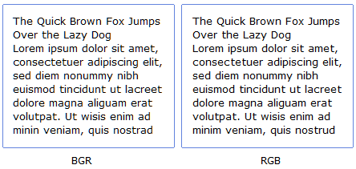

Szóval itt a Karácsony, az év végi pihenés, és hazahoztam a laptopot Pestről. Megszokásból rádugtam az itthoni monitort is, hogy nagyobb helyem legyen a képernyőn. Emlékszem, már nyáron is gyanúsan homályos volt a képe, de azóta meg is feledkeztem róla. Most viszont megint felidegesített, és hosszas nyomozás után végre kiderült a turpisság: a külső monitoron a subpixelek nem RGB, hanem BGR sorrendben vannak, pont fordítva, mint a laptopon.

Ettől aztán a Vista ClearType fontjai megzavarodnak, és úgy néznek ki mint... nos, nézzék meg inkább maguknak:

 A két kép közül nálam a baloldali éles a külső monitoron, a jobboldali pedig a beépítetten. Vicces nézni, ahogy áthúzom az ablakot az egyik monitorról a másikra, és ettől minden megváltozik...

Szerencsére pár éve, Microsofték beépítették a ClearTypeba a BGR támogatást is. De vajon gondoltak-e a hozzám hasonló szerencsétlenekre, és lehet-e a két monitoron különböző BGR/RGB beállítást használni?

Idézet a FAQ-ból ([http://www.microsoft.com/typography/ClearTypeFAQ.mspx](http://www.microsoft.com/typography/ClearTypeFAQ.mspx)):

> **Q.** Can ClearType be automatically turned off when my laptop is docked and used on a CRT screen? **A.** No. You cannot have different settings for each monitor in a multiple-monitor setup or when docking a laptop.

Gratulálok.... @%!? ק&!

### Kiegészítés 1:

Kedves nem színtévesztő barátaim!

A rondábbik kép fekete-fehér, vagy inkább szivárvány színű? Úgy sejtem, hogy az utóbbi, mert nekem is elég furának tűnik...

### Kiegészítés 2:

Hmmm... és mi lenne, ha a videokártyával fejreállíttatnám a képernyőt, aztán leszedném a monitort az állványról, és fejjel lefelé visszacsavaroznám...  Aha, működik!

Ez már nagyon beteg...
