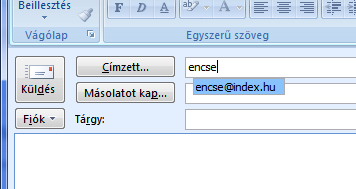

Kedveseim! Elnézésüket kell kérnem a költözés miatt, de baszta a csőrömet (milyen találó metafora), hogy mindenem szét van szórva egy csomó helyre. Tudnivaló, hogy az informatikában csak két számot szeretünk, a nullát meg az egyest, és ha már a blogírás, meg a netes _jelenlét_ _mellett_ tettem le a voksomat, kénytelen vagyok az egyest választani.

Ezentúl ide fogok írni. Sőt, ha már belekezdtem, akkor végig is csinálom, úgyhogy ezentúl a nem munkával kapcsolatos levelezésemet is egy új címről, az [encse@csokavar.hu](mailto:encse@csokavar.hu) -ról fogom intézni. Természetesen megtartom a régi indexes címet is, de az idővel remélhetőleg ki fog pusztulni.

Ha megengednek egy tippet a végére. Nem mindenki tudja, hogy az Outlookot igenis rá lehet venni, hogy elfelejtsen egy email címet. Előbb írjuk át az esetleges névjegyeket, majd kezdjünk egy új levelet, de csak annyit írjunk be címzettnek, hogy _encse_.  Aztán amikor az Outlook felajánlja a régi címemet, válasszuk ki a nyilakkal, és nyomjuk meg a delete gombot. Tehát valahol itt:

Ezzel a képfeltöltést is kipróbáltuk :)
