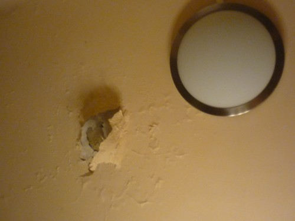

Úgy tűnik, mostanában jobb szeretem pennámat máshová mártog... akarom mondani, kissé kevesebb leírandó marhaság jut eszembe. De megint rám szakadt a szombat, és ilyenkor menetrendszerűen beköszönt az írhatnék is. Fura dolog ez ezzel a múzsával. De az legalább már biztos, hogy nem zsidó származású.

Persze nehogy azt gondolják, hogy nem lenne miről írni. Ahogy öreganyám mondaná: mindig szarik a kutya valamit. (Azt is szokta mondani, hogy "egyik 19 a másik meg 20", de ennek jelen körülmények között semmi értelme. Csak úgy hozzáteszem, mert ilyen vagyok: megosztom Önökkel a vidám dolgokat.)

Szóval a Kutya. A Kutya most azt találta ki, hogy beázik a fürdőszoba plafonja. Nem is kicsit. Enikő készített is róla néhány felvételt, bár nem tudom, mennyire látszik. Azért ideteszek egyet.

A közepe, ahol a vakolat is kilóg, kb. egy arasznyi terület. 1 hónapig kell figyelni, hogy miután a vízvezeték-szerető a felső szomszéd lefolyóját kipucolta, vajon jelennek-e meg újabb foltok vagy repedések. Ezért dokumentáltuk a dolgot, sőt a biztonság kedvéért a minap egy filctollal be is jelölgettem a már meglévő repedéseket.

Aztán. Enikőt bemutattam tesóimnak. Ez a rendes éves tökfaragás alkalmából történt, és szerintem nagyon jól sikerült a dolog. Idén három tököt is csináltunk, minden gyerek magának egyet. Sütőtök is készült, bár öcsémék az evés részét már nem várták meg valami halaszthatatlan oknál fogva. Azért valahogy megoldottuk nélkülük is.

Kicsit homályosak lettek a képek, de ez pl. egész jól sikerült. Balról jobbra: Encsé, húga és öccse kézimunkája látható. Bár amennyire emlékszem húgom helyett inkább sógor dolgozott, mégpedig előre papíron megtervezett sablon alapján. Én már csak maradok a szabad kezes technikánál. Tudom, idétlen lett a végeredmény, de azért élveztem a dolgot.
