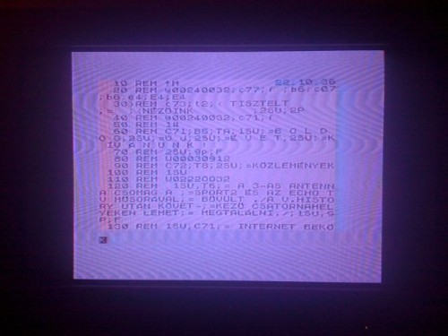

Minap átkapcsoltam a kábelszolgáltató (sima lakótelepes lóf�sz) csatornájára. Hát mit látok kiítűnő HD minőségben. Na mit?

Az úgy nevezett modern technológia betört a TV szolgáltatókhoz is. Ez nekem valami Commodore képernyőjének tűnik, azon belül is valami BASIC szerű programnak, amiben viszont minden sor ki van kommentezve. Magyarán ez valami félseggű prezentáció formátum. Ha jobban megnézzük, még jóképű vezérlőszekvenciák is vannak benne: 1SU;C71; = és társai...

Viszont nem vágom, hogy melyik Commodore gépen volt 32 karakter vízszintesen egy sorban. C64-en 80 karakter volt, VIC-20-on meg 22. Ötlet?
