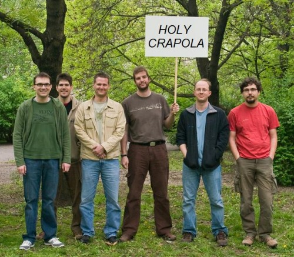

Toltunk egy jobbféle demót a minap. Vannak reakciók, [videó](http://msdn.microsoft.com/en-us/oslo/dd727740.aspx) meg [minden](http://www.martinfowler.com/bliki/IntentionalSoftware.html) :)

\* @pandemonial Quite impressed! This is sweet! Multiple domains, multiple langs, no question is going unanswered \* @csells OK, watching a live electrical circuit rendered and working in a C# file is pretty damn cool. \* @jolson Two words to say about the Electronics demo for Intentional Software: HOLY CRAPOLA. That's it, my brain has finally exploded. \* @gblock This is not about snazzy demos, this is about completely changing the world we know it. \* @twleung ok, the intellisense for the actuarial formulas is just awesome \* @lobrien This is like seeing a 100-mpg carburetor : OMG someone is going to buy this and put it in a vault!

Maya hozzáfűzése:

Saját hozzáfűzésem:

[https://csokavar.hu/projects/teameditor/?q=HOLY%20CRAPOLA](https://csokavar.hu/projects/teameditor/?q=HOLY%20CRAPOLA)
