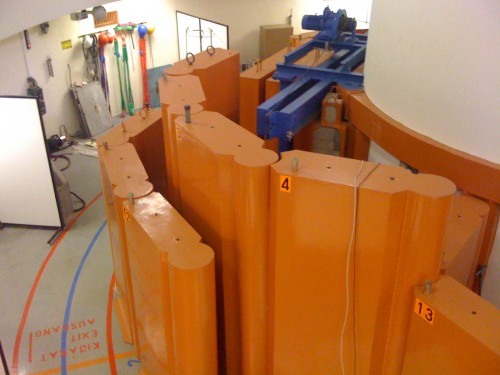

Pénteken a Kutatók Éjszakájának keretében megnéztük a BME kísérleti atomreaktorát belülről, működés közben. Csináltam pár képet.

Ezekkel a beton tömbökkel veszik körbe a reaktort kívülről.

A besugárzott mintákat itt veszik ki abból a tokból, amiben a reaktorban csücsültek.

Huzalozott logika vezérli a reaktort

Még több műszer. Sajnos már nem emlékszem mi volt az első 3 szekrényben. A negyedik a reaktor sematikus ábrája, az ötödik-hatodik pedig a fenti huzalozott logika tárolására szolgál.

Így néz ki a vezérlő a reaktor tetejére vezető hídról.

Ez a reaktor teteje, ahol nem szabad fényképezni, mert felülről nincs teljesen lefedve a dolog, és kellemetlen, ha belesik valami...

Ha lehetett volna fényképezni, ilyet csinálhattam volna. Alul a kék fény az ún. Cserenkov-sugárzás. Ez akkor keletkezik, amikor a maghasadás során keletkező neutronok eltalálják a lassításukra odakészített vízben levő hidrogén elektronjait. Ezek az elektronok aztán úgy begerjednek, hogy gyorsabban kezdenek rohanni, mint ahogy a fény halad az adott közegben (víz). A nagy energiájukat nagy energiájú fény kisugárzása kíséri, amit az ember kéknek lát.

Csőpostával lehet kisebb mintákat juttatni a reaktorba. 

Innen indulnak a minták, és ide is érkeznek vissza. 

Ha majd egyszer kiégnek a fűtőelemek, akkor ebben a tartályban fogják őket elszálítani. Ez lassan 40 éve itt áll. 

Ha olyan mintákat kell vizsgálni, ahol problémát jelent a környezet sugárzása, ebbe a dobozba teszik bele, ami jól leárnyékol minden külső hatást. Itt említette a bácsi, hogy a falához nem lehet akármilyen fémet használni, mert a Földön a második világháború végétől végzett felszíni atomrobbantások miatt a legtöbb fém elszennyeződött már valamennyire. Az ilyen ládikákat tehát még a világháború előtt, vagy közben elsüllyedt hajókból, lerombolt hidakból nyert fémekből készítik... 

Ha nagyon nagy mintát akarnak besugározni, akkor azt ezen az ajtón keresztül, csillével lehet bejuttatni. 
