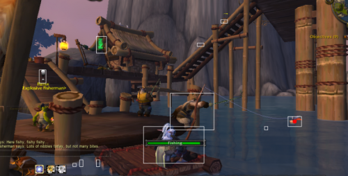

A horgászás Wowban úgy működik, hogy bedobod a csalit, vársz egy kicsit, amíg ráharap valami, aztán amikor hallod, hogy kapás van, jobb gombbal rákattintasz az úszóra, és bezsákolod halat.

Ezt persze hamar meg lehet unni, de nekem sok hal kellett, úgyhogy kipróbáltam az [Ultimate Fishbotot](http://fishbot.net/), ami automatizálja a horgászást. Sajnos csak az esetek egy részében működött jól, a többiben nem találta meg az úszót a képernyőn. Még szerencse, hogy programozó vagyok, így rögtön kitaláltam valamit ami jobban működik. [AForge.Nettel](http://www.aforgenet.com/news/2012.02.23.releasing_framework_2.2.4.html) és képelemzéssel közelítettem meg a feladatot.

Dobás előtt készítek egy screenshotot, majd dobás után egy másikat. A kettő különbségéből látjuk, hogy hol változott a kép. Az AForge.Net BlobCountere ezeket téglalapok sorozataként adja vissza. Némi rendszerintegrációval (copy paste), ezt összegányoltam a Code Projecten talált [motion detection](http://www.codeproject.com/Articles/10248/Motion-Detection-Algorithms) cikkből.

Már csak annyi a dolgunk, hogy végignézzük a téglalapokat, hogy melyik lehet az úszó. Ezt abból vehetjük észre, hogy az úszó fölött megváltozik az egérkurzor. (Némi Win32 mágia ismét szükségeltetik.)

Ha minden megvan, már csak várni kell a kapásra. Ez is automatizálható, elég figyelni a hangokat. Amikor kapás van, azt ugyanis egy hangos csobbanás kíséri. Még egy kis jelfeldolgozással ezt is kiszűrhetjük, és kész is a horgász robotunk (avagy horgász-bot).

Nagyon jól működik. Percenként kb 4 halat fog, és nem nagyon fordul elő, hogy nem találja meg az úszót. Ha viszont mégis, akkor ez pillanatok alatt kiderül, és dob egy újat. Már csak emiatt is jobb mint a végső halbot, mert az meg azt csinálja, hogy dobás után elkezdi mozgatni az egérkurzort, felülről lefelé és balról jobbra. Ha megváltozik a kurzor, akkor örül, de sajnos előfordul, hogy túl sokat pöccint az egéren, és átugorja az úszót. Csak nagy sokára jön rá ilyenkor, hogy újra kell próbálkoznia. Ráadásul csak úgy működik, hogy tökig bezoomolsz a vízre, hogy ne legyenek zavaró körülmények. Az enyémben ez a korlátozás sincs. Így mégiscsak társasági élmény lehet az automatizált horgászat.

Igazából ez tök jó feladat volt. Ha legközelebb digitális képelemzéssel akarok játszani, biztos hogy a wowban fogok valamit automatizálni. Ma már el is kezdtem továbbfejleszteni a botomat, hogy követni is tudja az úszót, így horgászás közben akár körül is lehetne nézni. Ez persze már jóval nehezebb feladatnak bizonyult, és nem is lett valami stabil a végeredmény.

### Update 2013. december 28.

És az egész elérhető githubon is [erre](https://github.com/encse/horgaszbot).
