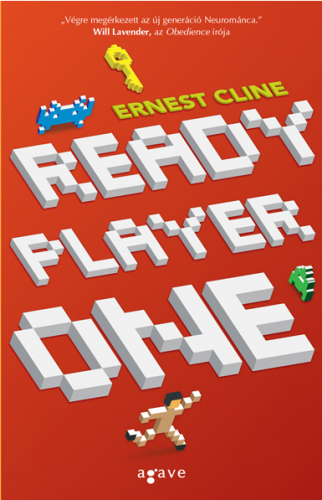

Tudom, hogy mostanában alig-alig blogolok, de szeretném visszahozni ezt a jó szokásomat, mert hát mitagadás hiányzik az írás. Jó dolog szavakat egymás mellé rakni, és később visszaolvasni. Bár mióta gyerekeim vannak, csak lopva találok magamnak egy kis időt. Az is főleg arra elég, hogy kipihenjem magam a következő műszakig.

Megpróbálok ezentúl megint legalább hetente írni, így hátha sikerül Önöket is visszacsalogatni. Bár sajnos Apád nevű olvasónk már nem szól majd hozzá a bejegyzésekhez, hiányozni fog.

Próbálok visszatalálni a szokásos stílusomhoz, gondolom eltart egy ideig.

Kezdetnek leporoltam a kinézetet. Így mobilbarátabb, meg mégse olyan kétezres évek eleje. Na nem mondom, hogy tetszik. Amit most látnak az a Wordpress twentythirteen, azaz 2013-as sablonja, szinte semmit sem változtattam rajta, csak a betűket meg egy picit a betűméretet. Véleményem szerint egyszerűen ronda, de még csiszolgatom. Van már például egy [about](https://csokavar.hu/about) page, ez van most a LinkedIn-re belinkelve fogadó oldalnak. Na, ez már kezd hasonlítani arra, amire gondoltam.

Pár hete fejeztem be Ernest Cline Ready Player One című könyvét, és Facebookon ajánlgattam is már, sőt Maya el is olvasta. Régen volt a kezemben ilyen szórakoztató könyv.

A történet szög egyszerű, ráadásul egy szálon fut, amit még a buszon is képes voltam követni. Volt egyszer egy milliárdos bácsi, aki imádta a nyolcvanas évek kultúráját, és a számítógépes játékokat minden mennyiségben. Később készített egy virtuális valóság szimulátort, ami ez egész bolygón széleskörben elterjedt, és szinte mindenki ebben éli mindennapi életét. (A bolygó közben enyhén lepusztult egyébként.) Még a halála előtt készít egy játékot a játékban, afféle kincskeresést, és arra hagyja az összes pénzét, aki a kincset leghamarabb megtalálja.

Mondom, hogy szögegyszerű. Aztán  persze mindeki rápörög a témára, és megindul a kutatás. A kincskeresés mindenféle nyolcvanas évekbeli dolgokra tett homályos utalások megfejtését jelenti, és ez adja a könyv lényegét, ugyanis az egész egy végtelenre nyújtott iddqd heti retró, sztorikkal és nosztalgiázással.

Alig tudtam letenni olvasás közben, és előre sajnáltam, hogy hamarosan vége lesz. Csak abban reménykedhetek, hogy Cline bácsi ír még néhány folytatást valamikor.
