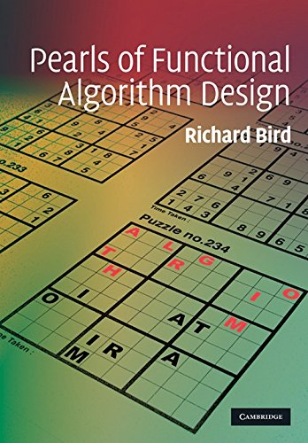

Megvolt a banki elszámoltatás. Bár nekem már nincs hitelem, mégis kaptam vissza valamennyi pénzt, amit könnyen jött könnyen megy alapon az amazonos wish listám (ez rémesen néz ki magyarul) kipucolására fordítottam. Jobban mondva csak egy részét. A másik részét a NAV-nak küldtem el, mert hiába töltöttem ki tavaly, adtam oda és pecsételtettem le, hogy nem kérem a gyerekek után járó adókedvezményt, a csodálatos mobilengines papírgyáros néni mégis visszaigényelte nekem. Így aztán én is és Enikő is megkaptuk tavaly a kedvezményt, amit most büntetéssel együtt csengethettem ki az adóbevallással. Ennyit a hozzáértésről.

Naszóval, megjött a harminc centi magas könyvkupac, és elsőként a [Pearls of Functional Algorithm Designnak](http://www.amazon.com/Pearls-Functional-Algorithm-Design-Richard/dp/0521513383) álltam neki Richard Bird khmm, hát... tollából. Ez a hasonló című Programming Pearls könyv funkcionális változata, eredetileg a Journal of Functional Programming számára készült cikkek újra publikálása kis pimpelés után.

Olyan jóféle progamozási módszertan funkcionális programozóknak stílusa van, de meg kell állapítanom, hogy már elszoktam az ilyesmitől. Minden fejezet felvezet egy problémát, és rögtön egy Haskell programmal specifikálja. Ez persze egyáltalán nem hatékony még, de a következő néhány oldalon egyszerű és ekvivalens átalakításokkal, illetve a megfelelő irányba mutató következtetésekkel kiesik belőle egy szép és most már gyors változat.

Mi ezzel a baj? Csak annyi, hogy hiába éreztem minden fejezetnél, hogy értem a lépéseket, a végére nem áll össze a kép. Egyszerűen nem látni a nagy ötletet a sok apró átalakítástól. Sokszor volt olyan érzésem a végén, hogy két oldalon is elintézhettük volna az egészet, ha előbb leírja a trükköt, aztán a végeredményt, és mondjuk a nem nyilvánvaló megjegyzéseket. Lehet, hogy akkor nem lenne ilyen szépen bizonyítva, mégis több hasznom származott volna belőle.

A harminc fejezetből kettőt hagytam csak ki, az egyik az aritmetikai tömörítés ténylegesen működő tárgyalása: végtelenül szőrözős. A másik pedig a Spider spinning for dummies volt, a legutolsó fejezet. Úgy kb a 25. fejezet környékén elindul a könyv a szellemi f�szverés legmagasabb fokára, ami a végére teljesedik ki. Egy semmilyen gyakorlati jelentőséggel nem bíró problémát tárgyal, bevallottan olyan extra nehezítésekkel, amitől nem lesz gyorsabb a kód, se rövidebb, se érthetőbb:

> The extra contortions that we need to go through in order to achieve looplessness are usually ill-advised, because they actually cause the total execution time to be longer than it would be with a more straightforward algorithm. But hey, looplessness carries an academic cachet. So we might as well treat this task as a challenging exercise that might help us to sharpen our algorithmic wits.

Ez a 28. fejezet elején van, a harmincadikra pedig teljesen csúcsra sikerül járatni. Szóval a pók pörgetést már nem olvastam el, de az vesse rám az első követ, aki.

Összességében a könyv hatása kicsit arra emlékeztet, mint amikor szétverik az ember agyát egy lédús citromszelettel, melyet vaskos aranytéglára erősítettek. Nem ölt meg, talán kicsit erősebb lettem tőle, de ki tudja... A polcon most már az eredeti gyöngyök is fent vannak, majd összehasonlítom őket, ha végeztem azzal is.

* * *

Illusztráció: [La Perle et la vague](https://en.wikipedia.org/wiki/The_Pearl_and_the_Wave) / Paul-Jacques-Aimé Baudry
