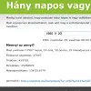

<article>

## Formlabs 2021-

2021-től a Formlabs magyarországi csapatát erősítem. 3D nyomtatókkal foglalkozik a cég, 2023-ban jelentettük be a FleetControl terméket, aminek együtt tettük le az alapjait. 

A 3D nyomtatás ma még picit bonyolultabb mint a normál papír alapú, és attól függően, hogy milyen technológiával nyomtatunk más-más előkészítés szükséges. Ehhez fejlesztették a PreForm nevű szoftvert, amiből segítettem kiemelni egy headless api részt, hogy a weben is tudjuk használni konténerizálva. Ez vastagon C++ meló volt és kb fél évet vett igénybe. Utána megörököltem a nyomtatók és a backend közötti kommunikációt, aminek a stabilitásán és monitorozásán dolgoztam javarészt Go-ban meg egy kicsit C++-ban. Végül az ehhez kapcsolódó szerver oldali logikát vettem át az előző fejlesztőtől, ami meg Python. 

Hová lettek azok a jó kis nyelvek, amiket szeretek?
</article>
<article>

## [Prezi 2014-2021](https://csokavar.hu/blog/tag/prezi/)

2014 nyarától (ismét) a Prezi.com fejlesztőjeként dolgoztam, középpontban az ötletekkel.

Éppen akkor adtuk ki a JavaScript alapú Prezi viewert, amikor megérkeztem, amit aztán vissza kellett húzni és csak 2016-ban jöttünk ki újra vele, de akkor már editálni is tudott.

Senior programozóként kezdtem, most (2019) a Pezi Next Editor frontend architectje vagyok. Dolgoztam a document modelen, a rendering pipelineon, a desktop alkalmazásba ágyazáson és a collaborative editing integrációján. Közben ütöttem a vasat, hogy a fejlesztés fenntartható irányba haladjon, dobtuk a Haskellt a Scala kedvéért, és a Haxe nyelvet egy belső fejlesztésű transpilerrel átfordítottuk TypeScriptre. Szóval nem unatkoztunk.
</article>
<article>

## [Mobilengine 2011-2014](https://csokavar.hu/blog/tag/mobilengine/)

2011-ben fordultam a mobil technológiák felé. A Mobilengine egy több platformon (Android, IOS, Blackberry, Windows Mobile) futó alkalmazás, amivel különböző űrlapokat lehet kitölteni, és egy nagy közös szerveren (ASP .Net és hasonlók) nézegetni. Sajnos ebből a cégből nem lett nagy durranás, de a fejlesztő csapat nagyon erős volt, sokat tanultam itt.
</article>
<article>

## [Intentional Software 2002-2011](https://csokavar.hu/blog/tag/isc/)

Intentional programming technológiák kutatása és alkalmazása, Charles Simonyi vállalatában. Természetesen minden szupertitkos, de néhány kapcsolódó történet a blogon olvasható.

2017-ben érkezett a hír, hogy a céget felvásárolta a Microsoft, így annak ellenére sikerként gondolhatok rá, hogy végül semmi nem lett nyilvános belőle.
</article>

Néhány kisebb-nagyobb projekt, amivel az évek során foglalkoztam. Némelyik ma is így néz ki, másokról meg csak ez a leírás maradt.

<article>

## [Mandelbrot drawers for vintage hardware (2021)](https://mandelbrot.csokavar.hu/)

Kicsit eljátszottam régi gépekkel meg assembly nyelvekkel és írtam néhány Mandelbrot halmaz rajzoló programot.
</article>
<article>

## [Advent of code (2015-)](https://github.com/encse/adventofcode)

2015 óta minden év decembere az Advent of Coderól szól. Érdekes történettel a mikulásról és nagy ellenfeléről a húsvéti nyúlról  
Minden napra jut két nem túl bonyolult programozós feladat, amiket aztán mindenki a saját kedvenc nyelvén oldhat meg.
</article>
<article>

## [Casette (2020)](https://casette.csokavar.hu/)

Nem túl nehéz programozási fejtörő, amit a 2020-as Advent of Code-hoz készítettem ráadás feladatnak. Van benne egy kis jelfeldolgozás. Az eredeti ötletet egy korábbi versenyfeladatból vettem, amiről már nem maradt fenn semmi kézzelfogható. Figyeljük meg a végtelen igényes kazetta designt, amit egy Petsci editorral készítettem egy délután leforgása alatt.
</article>
<article>

## [Loginmatrix (2018)](https://loginmatrix.csokavar.hu/)

Internet konzerváló céllal letöltöttem, kikukáztam és újra elérhetővé tettem az első hack me játékot, amivel valaha játszottam. Mai szemmel borzalmasnak találom, de valami szentimentális oknál fogva azért mégis itt van. Az utolsó pálya kivételével sikerült rekonstruálni az egészet.
</article>
<article>

## [NES emulátor (2016)](https://nes.csokavar.hu/)

Egy nagyon hosszú januári napon elkezdtem írni egy Nintendo Entertainment System emulátort. Jó két hónappal később eljutottam odáig, hogy stabilan fut benne a Super Mario Bros.
</article>
<article>

## [Mini Scheme (2015)](https://csokavar.hu/blog/2015/12/mini-scheme/)

Daniel P. Friedman és Matthias Felleisen Little Schemer és Seasoned Schemer könyvei és Duane Bibby remek illusztációi motiváltak arra, hogy végül én is készítsek egy saját Scheme implementációt.
</article>
<article>

## [Nand to tetris (2014)](https://csokavar.hu/blog/2014/06/the-elements-of-computing-systems/)

Építettem egy saját kis számítógépet NAND kapukból. Imádom ezt a könyvet.
</article>
<article>

## [Ray march (2013)](https://csokavar.hu/blog/2013/12/ray-trace-es-ray-march/)

Csináltam egy kis raymarch renderelőkét néhány gömbbel meg fényforrással. Elég jól sikerült, némi WebGL shader programozás kellett hozzá.
</article>
<article>

## [Horgász-bot (2013)](https://csokavar.hu/blog/2013/06/horgasz-bot/)

A World of Warcraft horgász minijátékának automatizálására készült. Van benne egy kis mozgásérzékelés meg egy kis hangérzékelés is.
</article>
<article>

## **CO**ZERO (2011)

A **CO**ZERO egy kicsi, de annál nagyobb kilátásokkal rendelkező kft, környezettudatos építészeti technológiákkal kapcsolatos tervezéssel és kivitelezéssel foglalkozik. Honlapjuk Wordpress alapú, a szokásos szabványbarát megoldásokkal. Feladatunk a domén-regisztrációtól a teljes átadásig mindent magába foglalt.
</article>
<article>

## Mérték Építészeti Stúdió (2010)

A Mérték Építészeti Stúdió Kft. honlapját 2010-ben csináltuk, én a kivitelezésért (XHTML, CSS, javascript, ASP.NET MVC) feleltem. Célunk egy könnyen módosítható, egyszerűen kezelhető oldal készítése volt.
</article>
<article>

## [Fogaskerék (2010)](http://fogaskerek.csokavar.hu)

A fogaskerék oldalt Mayával, a főnökömmel, együtt indítottuk, könnyebb-nehezebb matematikai, logikai és hasonló témákhoz köthető fejtörőkről. Az oldal a Hoppá! érzés fontosságát hivatott dicsőíteni.
</article>
<article>

## [ISC Team Editor (2009)](https://teameditor.csokavar.hu/)

Erős felindultságomban egy vállalati fényképezés után készült ez a kis szösszenet.
</article>
<article>

## Bilux Autósiskola (2008)

A Bilux Autósiskola honlapjának gatyába rázása viszonylag komoly feladat volt. Szerver oldalon a rémes LAMP támogatja, kliens oldalon pedig strict XHTML layout, valid CSS stíluslapokkal feldíszítve, és némi javascript varázslattal ropogósa sütve.
</article>
<article>

## [Hány napos vagyok (2008)](https://hanynapos.csokavar.hu/)

Ezzel a kis alkalmazással bárki kiderítheti, hogy éppen hány napos (órás, perces) az adott pillanatban.
</article>
<article>

## [Nagy adóvarázslat (2008)](https://ado.csokavar.hu/)

A Nagy adóvarázslat lényege, hogy a program egy beadott adószámból megmondja a hozzátartozó személy születésnapját.
</article>
<article>

## [Gekkó - a geek játék (2007)](http://gekko.csokavar.hu)

Második számú kedvencem a Csodálatos Geek Játék. Sajnos a magyar internetezők még nem jöttek rá, hogy mit is veszítenek a kihagyásával de annyi baj legyen. Talán idővel fordul a leányzó fekvése, és ebből leszek dothu milliárdos. A dolog egyébként informatikusoknak szóló logikai és programozós problémák leküzdéséről szól, egy a személyes varázsomat sem nélkülöző környezetben.
</article>
<article>

## [Wildcat Zsonglőr Oldalak (2004)](http://zsonglor.csokavar.hu)

Nagy kedvencem a már évek óta futó zsonglőr oldal. Eredetileg az egykori Wildcat Jugglers Tutorial szószerinti fordítása volt, de mára kicsit jobban kinőtte magát. Hogy mást ne mondjak, ebből indult a csokavar.hu is. Higgye el, feltétlenül el akarja olvasni, amennyiben kicsit is konyít a zsonglőrködéshez, vagy épp ellenkezőleg, de mindig is meg akart ismerkedni vele.
</article>
<article>

## [Rubik (1998-2001)](https://rubik.csokavar.hu/)

Ez tulajdonképpen az első valamirevaló progam amit valaha írtam. Dos alatt, Borland C-ben még a múlt évezredben... 2021-ben megtalaláltam, lefordítottam és DosBox-ban elérhetővé tettem.
</article>

A fentiek némelyike és egyebek megtalálhatók a publikus [GitHub](https://github.com/encse) oldalamon is.
