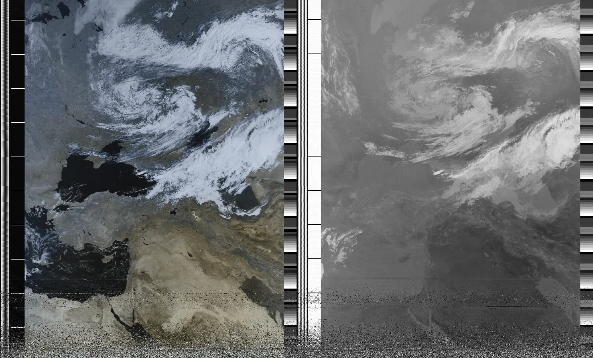
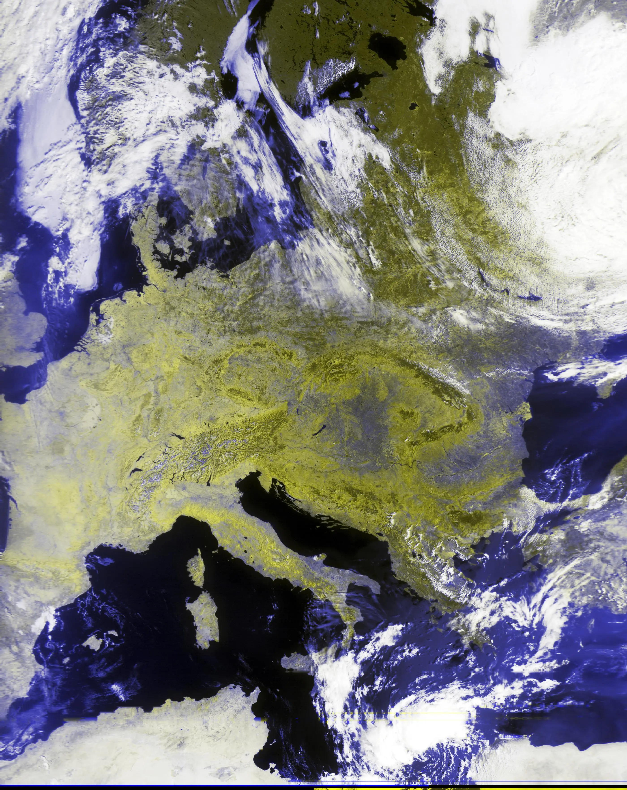

2023-ban rákaptam a Software Defined Radióra. Vettem egy RTL-SDR v3 donglet, és az egész hétvégét átjátszottam vele. Hallgattam a repülésirányítást, aztán találtam egy rádióamatőr átjátszóállomást a környéken, és azon keresztül néhány amatőr beszélgetést.

Amit csak találtam dekódoltam (morse, RTTY, ADS-B), de legjobban a műholdazás érdekelt. Mint kiderült, a mai napig van néhány olyan meteorológiai műhold, ami egy végtelen hosszú filmet/képet küld arról amit éppen maga alatt lát, mintha valami űrscanner lenne. Egész kis közössége van ezek hallgatásának és gyűjtögetésének. A legjobb pedig, hogy az ember hamar megismerkedik egy-két antenna fajtával, olyan fogalmakkal mint az LNA meg a T-Bias, meg a különféle kódolásokkal, amiket ezek a műholdak használnak.

Két családról beszélhetünk jelenleg, az amerikai NOAA és az orosz Meteor műholdakról. Úgy kell elképzelni, hogy ez a 3-4 műhold naponta néhányszor elrepül az ember feje fölött, és ha éppen akkor kint áll a kertben és az antennájával ez ég felé mutogat, akkor 137.5Mhz környékén mindenféle csipogást hallhat. A műholdak fekete-fehérben küldik a képet, de több hullámhosszon is fényképeznek, így ki lehet belőle keverni valami RGB-t, úgyhogy a végeredmény valami ilyesmi lesz:

Ami azért nem rossz egy darab dróttal a kert végéből. Ez tulajdonképpen a belépő szint, profibb felszereléssel még ennél is  jobb eredmény lehet elérni, vagy több műholdat befogni, de ahhoz már parabola antenna is kellene, praktikusan egy forgató motorral.

Egy másik érdekes projekt lehet az űrállomás hallgatása. Néha előfordul, hogy az űrhajósok iskolásokkal beszélgetnek, amibe kis szerencsével bele is lehet hallgatni:

<video width="70%" controls>
  <source src="/assets/page/sdr/files/iss.mp4" type="video/mp4">
Your browser does not support the video tag.
</video>

Máskor SSTV adásokat küldenek, éppen ezen a hétvégén indul egy pár napos session. Az SSTV tulajdonképpen csak egy képet jelent, nem igazi TV, jellemzően az orosz űrkutatás nagy pillanataiból kapunk néhány bélyegszerű izét. Szerintem rém ronda, de jó mulatság összevadászni, kicsit olyan mint a horgászat, sok türelem, és a végén a fene tudja mit jön ki belőle.

Persze SSTV adást bárki küldhet, akinek van rádióamatőr engedélye, és a 14.230 Mhz-es frekvencián folyamatosan megy is az adok-kapok. Hogy a csokavar se maradjon ki belőle, ideteszek egy kis easter egget. Ezt multimode cocoával készítettem, de akármelyik sstv dekóder tudja olvasni. Segítségképpen elárulom, hogy Scottie S4 formátumot használtam hozzá, bár anélkül is ki lehet találni egy kis próbálkozással.

[sstv](files/sstv.mp3)

Elkanyarodva az űr témától, elég könnyű belefutni Hamburgi hajózási térképekbe is, esetleg teletype időjárás előrejelzésekbe.

[gallery]
images/map.webp
images/map2.webp
images/map3.webp
images/map4.webp
[/gallery]

Ezzel persze még nincs vége, elkezdtem antennákat, szűrőket építeni. Vettem egy másik RTL SDR-t, ami jobban működik alacsony frekvencián, és egy mágneses hurokantennát is. 

Most egy kristály rádióra hajtok. Már van hozzá tekercsem meg egy old school változtatható kapacitású kondenzátorom, kellene még egy germánium dióda, és valami erősítő a kimenetnek vagy egy "nagy impedanciájú" hangszóró... Később FM rádiót is készítek, ha ez sikerül, és egyszer talán leteszem a rádióamatőr vizsgát, de az még kicsit odébb lesz.