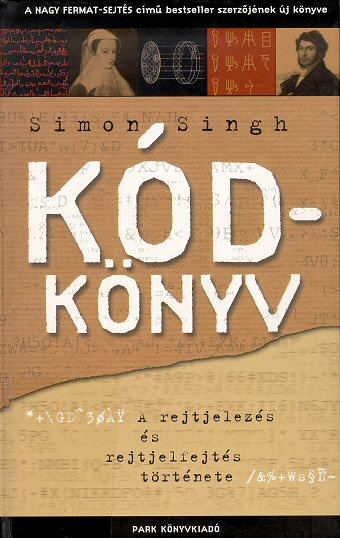

Simon Singh könyve, a Kódkönyv, a titkosírásról szól. Kezdve az alapvető betűcserélgetéstől, egészen a kvantumtitkosításig bemutatja a titkosírás fejlődését, a titkosítók és a kódfejtők örök párharcát. Valamiért nagyon szeretem ezt a könyvet. Még akkor is, ha nem én vagyok a kifejezett célközönsége. Érdekel, hiszen borzasztó kiváncsi vagyok, és az ilyen titkos dolgok mindig is megmozgatták a fantáziámat. Nincs tele mély techno blablával, remekül elmagyarázza miért rosszak a régi módszerek, és receptet ad a "kihüvelyezésükhöz" is. (Igen, ezt a hülye szót is ebből tanultam.) Ezon felül olvasmányos, és igazából csak ennyit várok tőle.

Ebből a könyvből tanultam meg, mi a [Vigenère](http://en.wikipedia.org/wiki/Vigen%C3%A8re_cipher) módszer, és hogy XIV. Lajos titkait őrizte évszázadokig. (Ez volt a '_chiffre indéchiffrable'_, azaz a megfejthetetlen kód.)

Aztán ott van persze a II. világháború híres [Enigmája](http://en.wikipedia.org/wiki/Enigma_machine), amit pontosan ismertet, és egy hosszú fejezeten keresztül mutatja be feltörésének történetét.

Van egy fejezet az egyipromi hieroglifákról, ami ugyan csak érintőlegesen kapcsolódik a témához, de végül is megfejtésük igazi kódfejtésnek tekinthető, ugyhogy miért ne?

Kb. ennyi ugrik be róla hirtelen. Reál érdeklődésű középiskolásoknak remek nyári olvasmány.

Hogy mi az apropója ennek a kis irománynak? Évekig kerestem ezt a könyvet, mert sajnos már nem kapható. Most viszont találtam egy kis [boltot](http://www.konyvbroker.hu/) a hálón, ahol még volt. Lehet, hogy az utolsó példány évekig porosodott a raktárban? Mindenesetre már náluk sem kapható...

szerENCSE.
