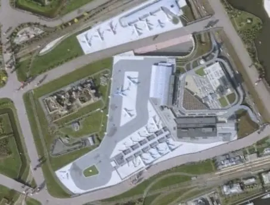

Megint játszottam a Google Earth-szel. Találtam egy kizárólag ezzel foglalkozó blogot. ([Erre](http://www.gearthblog.com/index.html)) Az egyik bejegyzés viszont annyira megtetszett, hogy muszáj vagyok ellopni. Az alábbi kép egy repülőteret ábrázol. De ha jobban megnézzük, emberek állnak körülötte (balra lent), és az egész csak egy modell. Jól demonstrálja a felbontást... [Megnyitás Google Earth-ben.](http://bbs.keyhole.com/ubb/download.php?Number=408419)

Más. Elsején lövik fel Discovery-t, úgyhogy az este hátralevő részében azon a kis műholdkövető programon fogok hackelni, amit kizárólag emiatt kezdtem el csinálni. Valós időben tudja a különböző műholdak (űrsiklók, űrállomás) helyzetét mutatni Google Earth-ben. Így most lesz egy f�sza kis trackerem, és megnézhetem a dokkolást. Kb. két napig tart, amíg az űrsikló eléri az űrállomást, és egy csomó ideig fogják kergetni egymást az égen, egyre közeledő pályákon. Az egész kicsit paradoxnak tűnhet, hiszen az űrállomás mindössze 300 km magasan kering, dehát ezt a NASA tudósok jobban tudják. Gondolom így lehet a legtöbb üzemanyagot megspórolni.

Egyébként azt tudták, hogy az űrállomás cirka két óránként megkerüli a Földet? Így naponta tizenkétszer megy le a Nap, és ugyanennyi napfelketét élvezhetnek az űrhajósok. Na, ettől aztán tutira fejreáll a bioritmusuk...

Íme egy link a NASA oldalára azoknak, akiknek nincs saját műholdkövetőjük (pórnép, hehe), de kíváncsiak a dokkolásra:

[http://spaceflight.nasa.gov/realdata/tracking/](http://spaceflight.nasa.gov/realdata/tracking/)

Ez persze csak 2D-ben van, de annyi baj legyen.
