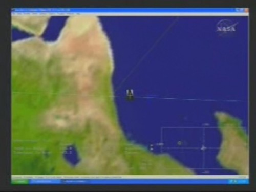
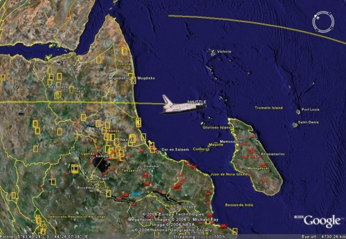

Na, sikerül a sajtótájékoztató után elcsípnem pár screenshotot Hustonból. Íme az összehasonlítás! (Klikk a képre.)

NASA:

 Vegyük észre, hogy XP-t használnak...

Google Earth:

Jobbra lent Madagaszkár látszik (Afrikától keletre ugye).
