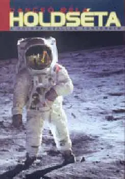

Ez mégiscsak egy blog valahol, így, még ha oly óvatosan is, de kénytelen vagyok megemlékezni a [charlesinspace.com](http://charlesinspace.com/) weboldalról. Hát csoda, ha az ember űrmániákus lesz egy ilyen cégnél?

Hadd ajánljak egy könyvet ismét. Dancsó Béla: Holdséta. Bazi vastag, és mi tagadás, elég száraz is, tele tényekkel, adatokkal. Ugyanakkor mégis élvezettel olvastam, mert szépen végigvezet az űr és a Hold meghódításának fázisain, a kezdeti rakétakísérletektől az Apolló 17-ig, meg az azt követő évekig.

Kis ízelítő. Azelőtt nem tudtam, hogy az egész űrizé tulajdonképpen a németek második világháborús rakétaprogramjából nőtte ki magát. (Von Braun és az ő V-2-es rakétái.) Isteni szerencse, hogy az atombomba a másik fél kezébe került. A két technika együtt, hááát...

A világháború után a szovjetek megszerezték a német rakéták terveit, az amerikaiak pedig szép csendben ellopták a rakétatudósokat. Egy ideig fej-fej mellett haladt a két társaság (Amerika kicsit lemaradva), mígnem a szovjetek fellőtték a Szputnyik I-est. Ezen ponton a könyv rámutat az egyszeri amerikai diszkomfort érzésére, amikor a hidegháború közepén, pár óránként elrepült a feje fölött egy kavics, ami folyamatosan azt csipogta, hogy bip bip. :)

Amerikának évekig nem sikerült átvenni a vezetést, csak loholtak a vetélytárs után. A szovjetek juttatták az első embert az űrbe (Jurij Gagarin), az amerikaiak ezt 23 nappal később érték el (Alan Shepard). Tyereskova volt az első női űrhajós, az első űrsétát Alekszej Leonov végezte.  A Hold meghódításakor azonban Amerika lassacskán fordított a helyzeten. Az oroszok megakadtak a fejlődésben, ráadásul egy kísérlet közben bekövetkezett robbanásnál meghalt egy csomó tudósuk is.

A Holdséta főleg amerikai szempontból tárgyalja az űrkutatás hajnalát. Ezt az egyoldalúságot sajnáltam, de kénytelen vagyok elhinni, hogy tényleg csak ennyit lehet tudni az orosz űrprogramról. Sötét titkok ezek...

A könyvet főleg azoknak ajánlom, akiket mélyebben érdekel ez a kezdeti időszak, és a rengeteg anekdota megismerése mellett elég fanatikusnak érzik magukat a tények átrágásához is.
