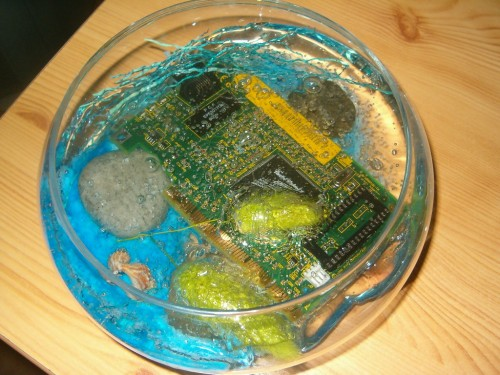
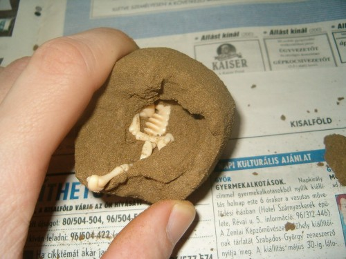

Idén annyi sok kurva jó ajándékot kaptam, hogy felsorolni is nehéz lenne, úgyhogy meg se próbálom, csak csemegézünk kicsit. Kaptam pl. egy jópofa asztali díszt. Egy üvegedény, benne mindenféle bizbasz meg egy _hálókártya(!),_ és az egész le van öntve azzal a zselés trutyival, amivel az ilyeneket le szokás önteni.

 Aztán megkaptam a Rózsa nevét DVD-n, ami egy tutter jó Umberto Eco könyv megfilmesítése Sean Connery-vel. (Idén ez volt a legjobb könyv, amit olvastam.)

A kreatív játékok vonalon kaptam (magamtól) három fajátékot: egy Soma-kockát, egy kígyószerűen széthajtogatható fakockát, meg egy szavakkal elég nehezen leírható, három egymásra merőleges tengelyből álló fabigyót, amit 6 részre lehet szedni, és utána kb. egy óra összerakni (de csak először).

Öcsémtől egy "Ásd ki a saját dinoszauruszodat" játékot kaptam. (Sajnos a dobozát kidobtam, így most nem tudok rákeresni a neten.) Szóval ez olyan, mint egy Kinder tojás. A belsejében egy dino csontváz van, de a lényeg a külseje. Ez ugyanis nem csokiból van, hanem az összes kis csontdarab bele van gyúrva egy jó kemény agyagos valamibe, és kalapáccsal meg kis ecsettel lehet kibányászni belőle.

