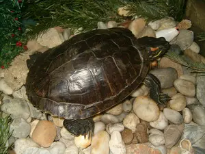

Ma megharapott ez a rohadt Nagy Hegyi Sárkány teknős (hogy lenne ez latinul?). Pedig csak ki akartam cserélni a vizét. Alig bírtam lerázni a kezemről, és még mindig fáj.

 Aztán büntiből kicsit a hátára fordítottam. Az a tévhit járja, hogy a teknős ilyenkor nem tud visszafordulni, pedig de. Mondjuk lehet, hogy a 20 centi mély tengerparti homokban nem tudna, de így, a köveken megy neki. Felnyomja a fejével magát, aztán valahogy hirtelen megpördül.

### jan. 26.:

Egy kis tudományos érdekesség a végére: [Miért olyan némely teknős páncélja, amilyen?](http://index.hu/tech/tudomany/gomb070124/)
