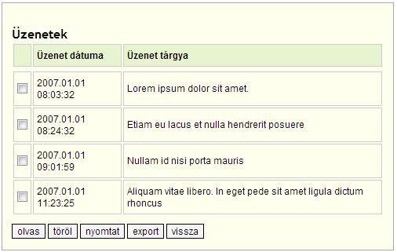

Azt hinné az ember, hogy legalább egy bank ad egy kicsit magára, ha már egyszer webes számlakezelőt csináltat. A stabilitás mellett én a kezelhetőséggel szemben is elég magas követelményeket támasztanék, ha én lennék az informatikai fejleszésügyi főelőadó szakmanager. De ezek? Csak egyet hadd emeljek ki.

Véletlenül rányomtam a postaládára, és valami ilyesmi jött ki:

 A törlés világos: kijelölöm, benyomom, letörlöm.

De minek a checkbox az ovasáshoz? Nem inkább az üzenet szövegéből kéne linket csinálni? Ha hármat kijelölök, és úgy nyomok az olvasásra, vajon mi történik? Hogy mi? HIBA. Azt nem szabad.

Miért nem tesznek a checkboxok mellé mindjárt radio buttonokat is? Azokat aztán össze lehetne csoportosítani, és úgy már csak egyet lehetne kijelölni. :)

A nyomtat vajon mit nyomtat? Hát nem a kijelölt bejegyzéseket: a táblázatot magát! Hasonlóan az exporthoz...

Áh. El is ment a kedvem az egésztől (még hosszan lehetne folytatni). Pedig tényleg nagyon fontos lenne, hogy az emberek megbízhassak ebben a szarban, hiszen mégiscsak itt tartják a pénzüket vagymi.
