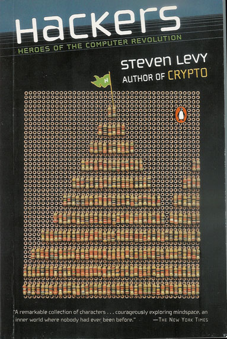

A héten megjött az egyik könyvem, amit még tavaly rendeltem a [Software Station](http://www.swsbooks.hu/)\-től. Steven Levy: [Hackers - heroes of the computer revolution](http://www.amazon.com/exec/obidos/ASIN/0141000511). Letehetetlen. Nem gondoltam, hogy idén már januárban elolvasom az év könyvét, de nincs kétségem afelől, hogy ez viszi el a pálmát. Kicsit ugyan lassan megy, mert angolul van, de azért nem vészes. Ráadásul túl jó ahhoz, hogy csak úgy félredobjam, tehát még így is hamarabb el fogom olvasni, mint egy hasonló hosszúságú magyarul írt könyvet. :)

Történelem. A dolog a számítógépekkel ott lett elrontva, hogy az MIT-n volt egy vasúti modellező klub. Mivel pedig egy normális terepasztal irányításához kell egy csomó relé, mindenféle switch, meg egyéb anyámkínja, néhány koszos, beszédhibás és erősen antiszociális fiatal, az autószerelőknél használatos gördeszkaszerű izén fekve, naphosszat csak ezeket buzerálta. Aztán véletlenül találtak egy lyukkártyarendező gépet valamelyik teremben, és beindult a fantáziájuk... Hogy működik? Mit lehetne ezzel csinálni?

Innentől már nehéz volt őket távol tartani az egyetem IBM 704-es gépétől, és nem sokkal később rátették a kezüket a 120 ezer dolláros PDP-1-re. (Ez már csak afféle miniszámítógép volt az 704-es mellett: második generációs gép lévén tranzisztorokkal működött, sokkal kisebb volt tehát, és a 15 tonnás hűtőrendszer sem járt hozzá szériatartozékként.) Mit is csinálna egy vérbeli hacker egy ilyen drága gépen? Természetesen [videojátékot](http://spacewar.oversigma.com/), hiszen olyan jó kis interaktív masina volt ez...

Akkoriban volt divat a 'gondolkodó gép' project, és mindenki a LISP-en, meg a számítógépes sakkon törte a fejét. Hőseink titokban összekötöttek két monstrumot, majd egymástól függetlenül mindegyikhez leültettek egy-egy professzort. "- Tessék, írtunk neked sakkot!" Folytassam? A dolog ott bukott le, hogy az egyik profnak gyanús lett, hogy a gép kicsit furcsa tempóban nyomtatja ki a lépéseket. Mintha egy ember gépelné valahol...

Ha benne vannak ebben az iparágban, el kell olvasniuk ezt a könyvet. Kötelező irodalom. Aztán ráismernek néhány kollégájukra, és azonnal meg fogják érteni, miért kezel harminc órát egy napként huszonnégy helyett, vagy miért írja át hétvégén az egész projectet mindenki háta mögött.

Relevántos linkek:

- [két fejezet a Műből](ftp://ftp.sac.sk/pub/sac/text/hckrs10.zip)
- [az index kritikája](http://index.hu/tech/szoftver/hack1201/)
