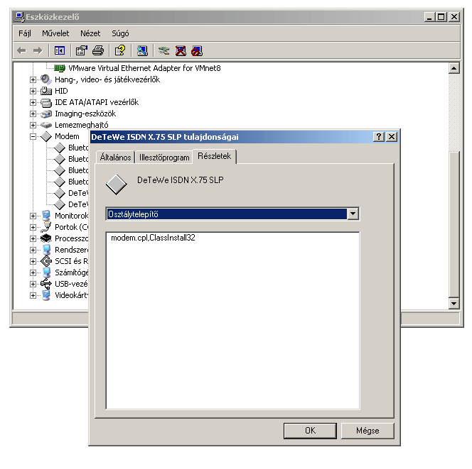

Már megint szívtam pár órát ezzel a remek kis Xp-vel. Vettünk egy USB Bluetooth adaptert, és sehogy sem sikerült feltelepíteni, mert a telepítés közben ezt a hibát kaptam:

> A Windows nem tudja betölteni a(z) Modem telepítőprogramját. Segítséget a hardver gyártójától kaphat.

Mondanom sem kell, hogy erre a hibaüzenetre egy találatot sem ad a google. Próbáltam angolul is, de semmi. (Itt most mellőzném az angoltalanított oprendszerek debuggolásának nehézségeiről szóló ömlengést.) Addig jutottam, hogy a modemek telepítése úgy általában nem működik. Régebbről volt feltelepítve néhány ISDN modem, próbáltam őket letörölni az Eszközkezelőben, de megint csak ezt a rejtélyes üzenetet kaptam. Hosszas próbálkozás után, néhány óra múlva feltűnt, hogy a modemek tulajdonságai között a részletek lapon az ún. osztálytelepítő (a seggem) nem más mint a `modem.cpl`. 

 

Ilyen fájl nincs a gépen. Hmm. A környéken levő gépeken ugyanitt az `mdminst.dll` szerepel. Talán valami régi setup felülcsapta a modemek xp-s *osztálytelepítő* beállítását a régi win98-as `modem.cpl`-lel. Hehh. Aszongya:

> A **class installer** DLL performs installation operations that apply to devices in a particular **device** setup **class**.

Ez megmagyarázza a dolgot... Aztán egy gyors keresés a google-ben (modem.cpl mdminst.dll), és máris kiderült, hogy egy sor a registryben (*regisztrációs adatbázis*) megoldja a problémát:

```
HKLM/System/CurrentControlSet/Control/Class/<CLSID>/Installer32
 "mdminst.dll,ClassInstall32"
```

Azóta működik.
