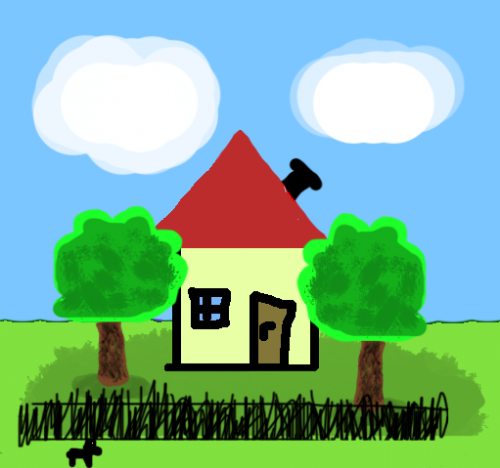
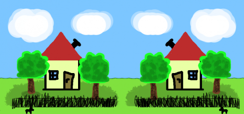
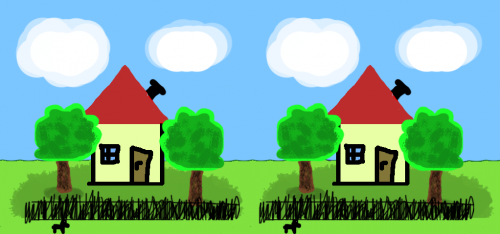
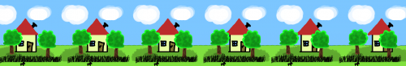

Dávidka nagyon unatkozott tegnap délután, úgyhogy azon kezdett gondolkodni, hogyan is megy a dolog ezzel a térlátással meg a távolságméréssel. Illetve, hogyan lehet két képből távolságinformációt kinyerni. A stereogramos részt az új könyvem ihlette, bár egyáltalán nem erről szól.

A  trükk abban rejlik, hogy a két szemünk picit eltérő perspektívából szemléli a világot. A két képből aztán az agyunk keveri ki a térélményt. Ez rögtön alkalmat is ad némi hackelésre: elég ha a két szemünket valahogy elkülönítjük egymástól, és más-más képet teszünk eléjük. Ennek kismillió módja van, de mind egy kaptafára megy. Nézzünk meg néhányat.

Vegyük az alábbi képet. Ez csak látszólag gyerekrajz, valójában Ágotával csináltam Photoshopban. (Egyedül hajlamos vagyok összekeverni a barnát a pirossal, és hülyén nézne ki egy piros fa.)

Mivel Bodri, a kerítés, a fák, a ház és a háttér külön layereken voltak, könnyű volt őket egymáshoz képest csúsztatgatni. Ezzel tudtam elérni, hogy az alábbi térhatású képeken, látszólag egymás mögötti síkokon úszva jelennek meg. Amikor a jobb szemmel látott képhez képest a bal szemmel látottat készítettem, az egyes layereken levő dolgokat más-más mértékben toltam el jobbra. (A perspektíva szabályainak megfelelően a távolabbiakat kevésbé, a kerítés előtt levő Bodrit a leginkább.) Lássuk az eredményt!

1\. Az alábbi módszert a gimis fizikakönyvemből tanultam. Fogjuk a két képet, tükrözzük az egyiket, majd helyezzük őket egymás mellé, valahogy így:

Fogjunk egy síktükröt, és az egyik szemünkkel a baloldali képet nézve, másikkal pedig a tükrön keresztül a jobboldalit, mozgassuk a tükröt addig, míg a két kép egymásba nem olvad.

2\. Aztán itt van ez, amit az új könyvem ihletett (majd arról is írok egyszer):

Fókuszáljunk a kép mögé, valahova a monitor túloldalára. Ha sikerül, a térbeli ábra a két kép között jelenik meg. Kicsit szellemképes lesz, de azért elég jól látható. A trükk itt az, hogy a helytelen fókuszálásnak köszönhetően az agyunk a bal- és a jobboldali kép részleteit megpróbálja párosítani, majd "egymásba olvasztani".

Talán kicsit egyszerűbb a képet meglátni, ha valahogy elszeparáljuk a szemeinket. Régebben csináltak olyan látcsőszerű izéket, amiből a lencséket kiszedték, és helyére ugyanannak a dolognak két, kicsit eltérő szögből készült fényképét tették. Tulajdonképpen elég egy DVD tokot (vagy valamit) a két szemünk közé tartani úgy, hogy egy szemünkkel csak a kép egyik felét lássuk. Ha sikerül, megszűnik a szellemkép, és csak egy ház marad középen.

3\. A fenti tulajdonképpen a [tapéta effektus](http://en.wikipedia.org/wiki/Autostereogram) legegyszerűbb esete. A lényeg itt is az, hogy két képrészlet különböző ismétlődéseit az agy "egybeolvasztva" értelmezi. Ha az ismétlődés nem pontos, azaz kicsit elcsúsztatjuk a képrészleteket, különböző magasságban lebegő síkidomokat kapunk. A képen Bodri 'követési távolsága' a legkisebb, aztán jön a kerítés, utána a fák és így tovább. Figyeljük meg, hogy a kép jobb szélén a kerítés már nem is a ház előtt van, teljesen kiesett a szinkronból.

 A megtekintéshez ugyanúgy a távolba kell fókuszálni mint a második példában, de talán érdemes a képet kinagyítani előbb. (Katt.)

Még sorolhatnám, de úgyis jobb a wikipédia, ráadásul ezen a ponton felébredt bennem a programozó, és elkezdtem a távolságmérésen gondolkodni. Végül nekálltam megírni egy automatikus ágyú programját. Nyilván soha nem fogom befejezni, de matematikailag azért sikerült megoldani. :) Íme a feladat.

Van két kameránk és egy ágyúnk, amit tetszőlegesen elhelyezhetünk. Ha a kamerák megpillananak egy (ellenséges) ágyúgolyót, mérjük be a pillanatnyi helyzetét, a becsapódás várható helyét és a kilövés helyszínét. Indítsunk ellentámadást a saját ágyúnk segítségével! (A közegellenállás elhanyagolható, a vidék síknak tekinthető.)

Útmutató: a két kamera képéből és egymáshoz viszonyított helyzetéből kiszámíthatjuk az ágyúgolyó helyzetét. (Ez tulajdonképpen két térbeli egyenes metszéspontjának kiszámítását jelenti.) Két egymás utáni mérésből pedig, felhasználva, hogy a gyorulás földi körülmények között konstans g, megkapjuk a röppálya szükséges adatait. (Itt pedig egy másodfokú polinom - az ágyúgolyó parabola pályán repül - együtthatóit kell meghatározni.)
