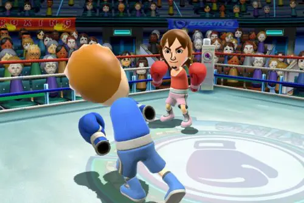

Vettem wii-t végre. Kicsit sokáig tarott, de végül a [Console corner](http://www.consolecorner.hu/)-ben találtam. Azóta az megy itthon. Öcsém boxol (már megszerezte az ezüstkesztyűt), a másik tesómmal pedig rendszeresen golfozunk. Nekem még bejön a tenisz, neki meg a bowling (gyémánt labda). Még majd veszek Zeldát, tölthető elemeket, meg azt a bizonyos [mérleget](http://wiinintendo.net/2007/01/15/wii-sports-experiment-results/) a jövő héten.

Egyébként mostanában remek ötleteim vannak geekség és zsonglőroldal témában. Csak annyira utálom ezt az egész php+javascript világot, amibe bezártam magam min. egy évre, hogy nem bírom gyomorral implementálni. :(
