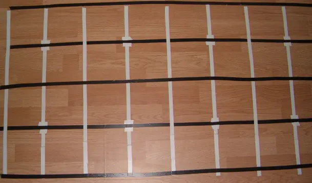

Folytattam a robotépítést és a Verseny24 feladatokat. Most éppen egy labirintusban mozgó roboton dolgozok. A labirintus cellákra osztott, minden cellának négy szomszédja van (kivéve a labirintus szélét természetesen). A cellák szigszalaggal vannak kijelölve, és a navigációt elősegítendő, mindegyik közepén vezet egy út, szintén szigszalagból. Az alábbi képen falak (akadályok) még nincsenek a labirintusban, ez csak az egész alapja. 2x4 cellát látunk, de a jobb szélső cellák széle lemaradt a képről.

Első lépésként csináltam egy cellák között mozgó robotot. Ahhoz, hogy egyet előrelépjünk két fekete-fehér kereszteződésen kell áthaladni. A múltkori vonalkövető robot tapasztalatait felhasználva a feladat viszonylag egyszerű, mégis elég sokat szívtam vele a fényérzékelő tökéletlensége miatt. A parketta és a fehér szigszalag fényessége között ugyanis nagyon kicsi az eltérés, ráadásul a fekete és fehér szigszalag határán az érzékelő időnként parkettát észlelt. Utóbbit csak a metszéspontok kihangsúlyozásával (még több fehér szigszalag, a képen T betűhöz hasonló végződések) tudtam orvosolni.

Többszöri 'szarok az egészre' után, végül mégis sikerült a sima navigáció. Ezen felbátorova, kicsit bonyolítottam a feladaton, és akadályokat tettem a labirintusba. Most a robot csak akkor hajtja végre a mozgást, ha útközben nem ütközik bele semmibe. Ellenkező esetben egyszerűen visszamegy a kiindulási pontra. A videón a 'menj egyet hátra' parancsot látjuk meghiúsulni egy flakon miatt (Vitaflóra, citrusfélék tápoldata).

[youtube src="SZxvTsMe2fQ"]

A felvételen hallható csipogás a tesztoutput része:

- 1 csipogás: hoppá, itt egy érdekes vonal. (Forgáskor illetve haladáskor mást jelent az érdekes.)
- 2 csipogás: hazaértem
- bonyolult csipogás: nem  sikerült a feladat.

A robot véges memóriája miatt a következő mérföldkő a számítógép-robot kommunikáció. Aztán akár csinálhatok egy labirintus feltérképező robotot is.
