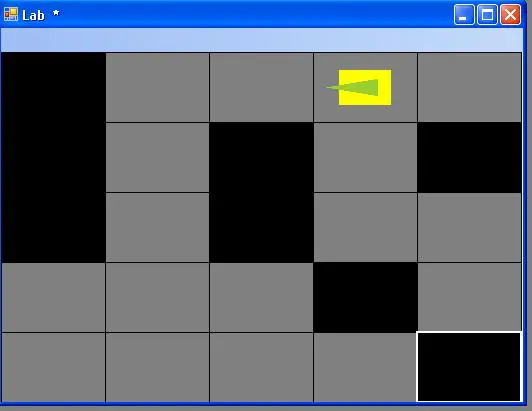

a robottal. Nem volt könnyű összehozni a kommunikációt, de végül csináltam egy C# wrappert a Mindstorms SDK GhostAPI-ja köré. A múltkor említett MS-féle implementáció sajnos túlságosan magasszintű volt, és ami a legfőbb gond: mindent közvetlenül akart irányítani az RCX-en, én meg elhatároztam, hogy a robot magától fog tudni a labirintus cellái között mozogni.

A [http://www.pinvoke.net/](http://www.pinvoke.net/) segítségével, meg egy C-s header fájllal elkészült az wrapper, aztán egy C++ példa alapján sikerült átküldeni egy számot a robotra, amit az beszorzott kettővel, és végül a PC visszaolvasta az eredményt. Numerikus coprocinak kicsit lassú, de azért működik...

Időközben csináltam (gányoltam) egy labirintus editort, amit összekötöttem a robottal, és most a billentyűzetről távirányítással tudom vezérelni. A múltkor már említett akadályérzékelőt is felhasználva megcsináltam a labirintus felderítést is. Ezzel a Verseny24 labirintus témaköre lényegében kész. Már csak pár algoritmust kéne lekódolni, hogy a tudást felhasználva magától derítse fel a labirintust a robot, találja meg két pont között a legrövidebb utat, segítsen egy bajbajutott társának (MűanyagTál 1.0) eljutni A-ból B-be, satöbbi. Tkp. egész életemben ilyenekkel foglalkozom, úgyhogy ez a rész annyira nem vonz.

Ilyen a labirintus editor. A robot úgy néz ki mint egy tank, de a valóságban sokkal aranyosabb.

 Még egy LEGO-LOGO program hiányzik, és azzal 5 évvel a verseny után végre kész is lesz minden (vagy inkább: meg lesz oldva minden).
