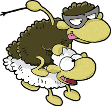

Hááát szóval az unokatesóm mutatta ezt a kis játékot úgy tíz éve, és mivel a héten megint retrójátékokkal játszottam (GTA2), ez is eszembe jutott. Sven Bømwøllen a becsületes neve, [innen](http://www.pctip.ch/downloads/dl/20674.asp) lehet letölteni. (Van még sok verziója, de én ezt láttam először, úgyhogy ez tetszett a legjobban.)

Kár tagadni, ez egy olyan felvilágosult játék. De vicces. Csak kicsit nehéz irányítani, mert a négyzetrácsokra osztott pálya 45 fokkal el van forgatva, így pl. a 'fel' 'jobbra fel'-t jelent. De meg lehet szokni, és utána már szórakoztató.

Ajánlom a sellőt, a kutyát (3. pályától) meg az ufókat a negyedik pályától.
