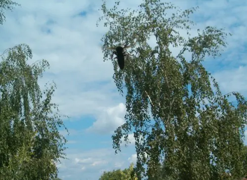

Tegnap éppen elkezdtem egy bejegyzést, amikor az alábbi szörnyetegre lettem figyelmes:

Azt hiszem ez egy pirosfoltos darázs, de nem vagyok darázsológus. Mindenesetre kurva nagy volt, kb 4 centi, és félelmetes. Végül aztán úgy döntött, hogy kirepül.

Darazsakkal kapcsolatos kalandjaim között megemlítendő, amikor egyszer régen belerepült a szemembe egy darázs(?), egy másik alkalommal meg beleléptem egy méhecskébe. Az utóbbi volt a rosszabb, mert kb egy hétig viszketett tőle a talpam. Azóta tartjuk egymástól a tisztes távolságot...
