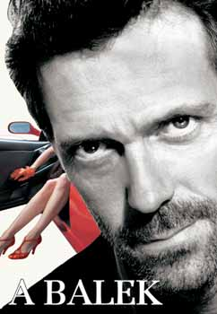

Nagy Dr. House mániás az egész iroda, így adni kellett egy esélyt a Laurie könyvnek: hátha. Annyira rossz csak nem lehet... Valami bugyuta kis történetre számítottam, viszonylag élvezetesen megírva, a végén jópofa csavarral, amitől jó szájízzel teszem fel a polcra, hogy egy fél év múlva örömmel adjam kölcsön valakinek, aki persze elfelejti visszaadni. Ahogy ez már lenni szokott.

De nem így történt. A három kívánalamból csak a bugyuta kis történet volt meg. Csavar nincs, a szöveg pedig túlerőltetett metaforákkal van tele. A legnagyobb poén talán az volt, hogy szinte minden kétszer van leírva. Valahogy így:

> Paulie pontosan egykor érkezett, de tudtam, hogy bocsánatot fog kérni a késésért. – Bocs, hogy késtem – mondta. – Mit iszol?

Lehet, hogy a kiadó szótagszámra fizetett. Esetleg ez az a híres angol humor, amivel mindenhol reklámozzák a művet. Nem tudom.

Szerintem ez a könyv szar, és nyomhattak volna valami értelmes dolgot is arra az egyébként borzasztó finom illatú papírra. Annyira jó illat volt a boltban, amikor vettem! Imádom a könyvszagot.
