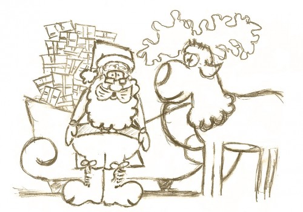

Tegnap volt Télapó, úgyhogy kapnak egy félkész rajzot, amit a tesóm barátnőjének csináltam pár hete, mert valami gyerekrajz pályázatra akarta beküldeni „Lappföldi találkozásunk a Mikulással” témában. Ez nem az egész rajz, pl. hiányzik Rudolf feneke, meg úgy általában az egész találkozás, de valahová elkevertem a kész verziót.

Este kopogott valaki az ablakon, amiről először azt hittem, valami csöves, és ki se mertem nézni, aztán kis idő (és sok kopogás) után felhívott a húgom, hogy nem akarom-e megnézni mi van az ablakban... Hát nem odatojt a Télapó valami finomat!
