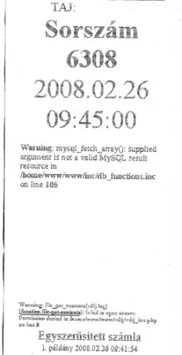

Annak idején Kevin Mitnick egy telefonfülkéből feltörte a Pacific Bell számítógéprendszerét. De próbálta volna meg ugyanezt egy pénztárgéppel...

És ha majd egyszer valaki 432273432678127632876783216837216378493274892136712356752163 Forintot üt be, akkor letörlődik az egész adatbázis... esetleg nem kell többet vizitdíjat fizetnie
