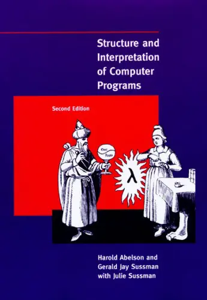

Encsé nagyon leépült mostanság. A héten már a harmadik testrésze gyulladt be: a  bölcsességfoga, pontosabban a fölötte levő íny, amitől sosem tudott rendesen kinőni az a szegény fog. A fogorvos bácsi szerint ki kellene húzni, mármint ki kellene vésni onnan. hátaf�szom

Közben elkezdtem olvasni a Structure and Interpretation of Computer Programs című könyvet. Most vagyok a közepén, és tetszik. Bár eddig csupa olyan dologról volt benne szó, amit hallottam már az egyetemen (ha más nem a Horváth Zoltán-féle kurva jó Clean előadáson). Viszont van benne egy csomó jópofa konstrukció, meg bonyolultnak látszó problémára adott elegáns válasz, ami miatt nagyon élvezetes olvasmány.

Inkább nem másolnám ide a [tartalomjegyzéket](http://mitpress.mit.edu/sicp/full-text/book/book-Z-H-4.html#%_toc_start), de az első fejezet a függvényekkel elkövetett absztrakcióval, a második az adatabsztrakcióval foglalkozik, tisztán funkcionális megközelítést alkalmazva. Nagyjából mindenféle jóság benne van, amire csak gondolni lehet, és az első fejezet végére annyira gyönyörűen épül fel a különböző trükkösebbnél trükkösebb függvényekből (higher-order functions) az Anal I-ből megismert gyökvonó algoritmus, hogy csak áradozni lehet róla.

Az imperatív szar a ventillátort a harmadik fejezetben üti meg, amikor bevezetésre kerül az értékadás mint olyan. A szerzők ugyanis azt az elvet hangsúlyozzák, hogy a világot (és a benne felmerülő problémákat) igazából ojjektekkel, ezek állapotaival, kölcsönhatásaival ésatöbbi lehet jól modellezni. Az értékadásnak természetesen komoly ára van, amiről hosszú értekezést kapunk például a konkurens számítások kapcsán. A fejezet végén aztán bepillantunk a 'mi lenne ha az állapotváltozások helyett inkább úgy gondolnánk a világra, mint állapotok egy pontenciálisan végtelen sorozatára' mondakörbe. Mivel pedig a végtelen sorozatot elég nehéz beleerőltetni a számítógép memóriájába, kapunk egy szép kis értekezést delayed evaluation-ről. Dióhéjban: ha egy sorozatból ki kell számolni egy másikat, akkor a kimenet tetszőleges prefixét sokszor előállíthatjuk úgy is, hogy a bemenetnek még csak egy adott véges kezdőszeletét ismerjük. Izünt det gréjt? (Tényleg az: beszarsz, behugyozol, amikor először látod.)

Hátra van még két fejezet, ami ha jól sejtem az első háromban bevezetett modellek implementálásáról fog szólni (nem biztos: angolul van...). Ha sikerül megrágni (bár itt már azért belassult a Zencsé), talán írok azokról is.

### Kiegészítés (március 15.)

Vége. A negyedik fejezet valójában a nyelvi absztrakcióról szól. Ez nagyjából az, amit a programozó egész nap csinál: nyelvek definiálása. Ha valaki, akkor én igazán tudom milyen ez, hiszen az elmúlt évben jóformán semmi mást sem csináltam, mint az A nyelvben megírt dolgokból B nyelvben megírt dolgokat készítettem egy C nyelven megírt transzformáció segítségével. És ha valami nem stimmelt, akkor megpróbáltam megbeszélni a dolgot az A, B vagy C nyelvért felelős kollégával. Szóval ez a negyedik fejezet, de a kóbor apácák megtévesztése végett LISP interpreternek álcázták. Ugyanis a LISP volt az a nyelv, amin a szerzők a nyelvi absztrakciót megpróbálták bemutatni. Szerintem értelmesebb lett volna valami könnyebben emészthető dologgal megpróbálkozni, mint a LISP-ben írt LISP interpreter, de azért sikerült abszolválni ezt is.

Az ötödik fejezet pedig egy regiszter gép modellezése volt. Ez tkp. olyan mint amilyennek az ember a számítógépet elképzeli: regiszterek, utasítások stb. Zárásképpen pedig megvizsgáltuk a regiszter gépen futó LISP interpertert, és a LISP-ből a regiszter gép nyelvére fordító compiler működését is.

Összességében az utolsó két fejezet sokkal aprólékosabb, mint az első kettő. Sok bennük a sallang, és nem olyan olvasmányosak. Kevesebb bennük a 'hoppá' élmény, de egyáltalán nem bántam meg, hogy elolvastam ezt is.

Már csak azt sajnálom, hogy 22000 Ft-ba kerül a könyv, így nem biztos, hogy megveszem magamnak a polcra. Mindenesetre köszönet Charlesnak, hogy ajánlotta, és Mayának, hogy beszerezte a csapatnak
