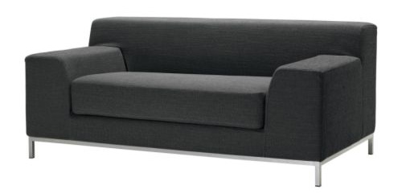

Nagyon előrelátó módon, még évekkel ezelőtt elkezdtem az irodában kallódó cuccokat magam köré gyűjteni. Hogy mást nem mondjak, így tettem szert a mostani telefonomra, egy virágra, a külső monitorra, kb. 5 irodai lámpára és végül egy kanapéra is.

Kezdettől fogva a barterezésen járt az eszem. (Jaj, hogy hívták a Rejtő könyvben a csávót, aki a hullák iratait gyűjtögette hasonló megfontolásból?) Éva is hamarosan rájött, hogy mindig tudok adni neki lámpát, ha szüksége van rá. Így aztán, amikor már sokadikra jött és visszakérte az addig ideiglenesen nálunk parkoltatott kanapéját, nem volt nehéz meggyőzni, hogy szerezzen nekünk egyet állandóra.

Mindez pár hónapja történt, de az is lehet, hogy még tavaly, és Cactusnak most jutott eszébe, hogy választanunk kellene valamit. Kis gondolkodás után a review/brainstorming/alvós célokra egyaránt megfelelő [IKEA KRAMFORS](http://www.ikea.com/hu/hu/catalog/products/S49841646) kanapé mellett döntöttünk. 

Ilyen szürke. Hát nem gyönyörű? Alig pár nap elteltével, ma reggel már meg is érkezett, gyorsan összeraktuk a lábait, és már ott ihattam meg az ebéd utáni kávémat. Szerintem tökéletes.

Éva, innen is köszönjük!
