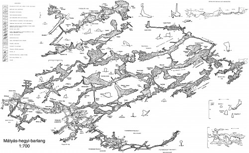
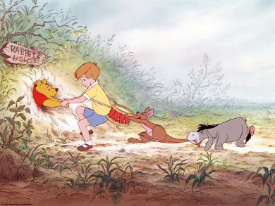

Júlia a hétvégén barlangász túravezetői vizsgát tesz. Ennek azonban előfeltétele volt, hogy - egyelőre még felügyelet mellett - egy kisebb túrát vezessen néhány jó barátnak. Szerda délután tehát felszedelőzködtünk, és a legszarabb ruháinkban felsorakoztunk a Mátyás-hegyi-barlang mellett.

A kirándulás alaphangját az az immáron évezredek óta kifogyhatatlan humorforrás adta meg, amikor Ádám (Júlia egykori barátja) bemutatkozott Évának, akiről tudni érdemes, hogy szintén túravezető szeretne lenni. Aztán a biztonság kedvéért még belém öntöttek egy csésze teát, és rám tukmáltak egy gyönyörű, kék kantáros nadrágot, hogy mégis inkább azt agyagozzam majd össze, és ne úgy nézzek ki hazafelé a buszon, mint a seggem.

Az öltözködés után jöhetett a lámpák bepöccintése. Ez Júliánál picit tovább tartott, ugyanis vagy eresztett a tartály valahol, vagy eltömődött valami, de semmiképp nem akaródzott az acetilénnek az _düznin_ keresztül kiáramlani. Közben azért megtanultam, hogy a _karbidlámpa_ azon a végtelenül leleményes módon működik, hogy fogunk egy kis _kalcium-karbidot_ (kb. fehér kavics) és ráöntünk némi vizet. Ebből égetett mész képződése mellett acetilén keletkezik, ami egyrészt jellegzetes szagú gáz, másrészt, és ez az ami számunkra a fontosabb: éghető és világításra alkalmas.

Felvágósan:

$$CaC_2 + H_2O = CaO + C_2H_2$$

(Ha most azt gondolnák, hogy karbid csak úgy terem a barlangban, akkor hozzám hasonlóan Önöknek is ki kell ábrándulniuk, mert - Júlia szerint legalábbis - azt is úgy kell gyártani mészkőből meg szénből viszonylag magas (2000 °C fölötti) hőmérsékleten.)

Aztán következett maga a barlang, ahová egy irgalmatlanul hosszú vaslétrán ereszkedtünk le. Az első érdekességet azok a _gömbüstnek_ nevezett képződmények jelentették, amiket emlékeim szerint rögvest az első nagyobb teremben találtunk. A gömbüstök a hévizes barlangképződés közben jönnek létre oly módon, hogy a vízben levő szén- és mindenféle más sav a mészkövet feloldja. Szép, kerekded mélyedésekre tessék gondolni, nagyjából olyanokra, mintha a sisakunkkal jól benyomkodtuk volna a barlang falát.

Szégyenletes, de nem emlékszem a termek nevére, meg a konkrét útvonalra. Ezt majd pótolni fogom a jövő héten, amint olyan állapotba kerül a lány, hogy megint lehet vele beszélni. Jelenleg kicsit izgul, ha jól veszem ki a szavaiból...

Mindenesetre a legjópofább dolgok közé tartozott, hogy amikor beértél egy terembe, amiből nyilvánvalóan nem volt kivezető út, akkor valamelyik vezetőnk, mintha az a világ legtermészetesebb dolga lenne, egyszerűen bemászott valami sziklaperem alá, vagy beereszkedett egy nyilvánvalóan alulméretezett résbe, és hipp-hopp, eltűnt benne. Aztán némi kapálózás és nyögdösés után mi is átjutottunk a másik - az előzőhöz megszólalásig hasonló - terembe.

És hát, amit el tudnak képzelni. Itt-ott egy két csillivilli kristály, vagy mészvázas állatka maradványai. Sőt: van egy kb. 3 centiméter hosszú cseppkőoszlop is a Mátyás barlangban. Ez utóbbi közvetlenül a Micimackóként emlegetett rés mellett található, ami a Nyúl üregében ragadt Micimackóról kapta a nevét. Nyilvánvalóan nem véletlenül... Júlia azért kipróbálta, és gond nélkül át is fért rajta. (A Túlméretezett Hasú Programozó nem vállalkozott a próbatételre.)

Volt még játszótér is, képzeljék. Ez egy olyan üreg végén található, ahol viszonylag több agyag van, és mindenféle jópofaságokat gyúrtak belőle a gyermeklelkű barlangászok. A gombától a teáskészleten keresztül a kis vonatig (sínnel, kocsikkal) mindenféle apróság megtalálható itt. Mi is bővítettük készletet egy igazán leleményes pöttyös labdával, aztán húzás tovább az Óriások útján át a Könyvtáron keresztül a Színház terembe.

Itt csakugyan volt egy kis színpad, meg egy nézőtér. Utóbbin megpihenve gyorsan megettük a csokit, és csináltunk egy kis sötétet. Végre tudom milyen az, amikor teljesen sötét van... Világító izék ugrálnak az ember szeme előtt. (Másra számítottak?)

Utána még egy kis mászkálás meg csúszkálás, de több említésre méltó élmény nem maradt meg a dologból. Odakint még rekordsebességgel megittam a sörömet és ettünk egy kis zsíros kenyeret (nyami). Végül csomóelmélet és gyakorlat, ahol horgoltam is egy övet csak úgy önszorgalomból.

Egy élmény volt, ahogy mondani szokás. Sőt: visszavágyok. Majd talán Önöknek is kedve támad csatlakozni valamikor.
