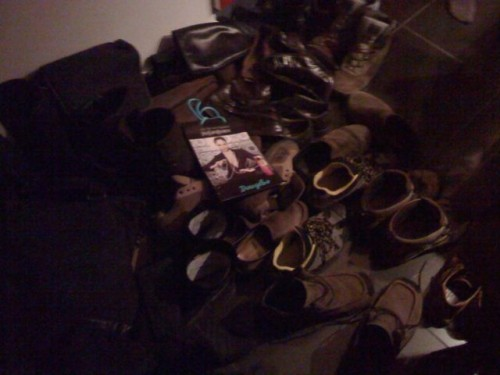
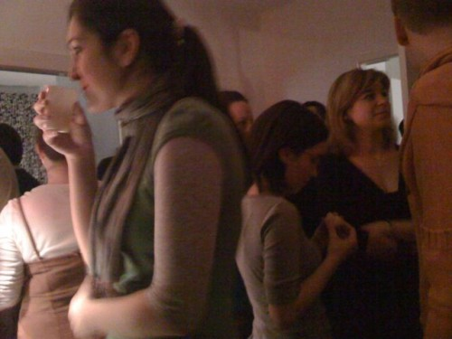
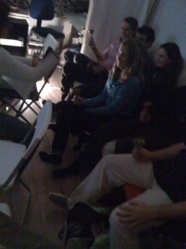

Balázsról még nem írtam Önöknek, pedig az unokatesóm. Művész lélek. Építész amúgy, de zongorázik is. Hobbiból. Magának. Karácsony alkalmából azonban idén már másodszor (szigorúan hagyományőrző jelleggel) karácsonyi zongoraestet adott az ismerősöknek, no meg a rokonságnak.

Jó volt! József volt meg a színes szélesvásznú álomkabát Andrew Lloyd Webbertől és Tim Rice-tól, zongorára átültetve, és projektorral kivetített képekkel illusztrálva-feliratozva. Rengetegen voltunk, ahogy a képekből is látszik, és mindenkinek tetszett. 

Egy másik nagy jóság meg az volt, hogy valakinek az anyukája hozott magával csengettyűket, amit kiosztott a hallgatóságnak (nekem az F-4 jutott), és aztán rajtunk játszott karácsonyi dalokat rámutatással... Hihetetlen, hogy egy ilyen, még talán egy 4-5 éves óvodásnak is elmagyarázható dolog, mekkora élvezetet nyújt a lassan harminc felé ballagó (és nem is ittas) társaságnak is :)

Köszönjük, Balázs, a remek estét!
