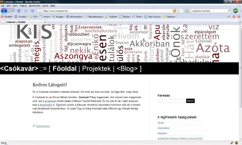

Meghekkeltem a ki se merem mondani melyik webes játékot, és most a headerben az utolsó néhány bejegyzésről láthatunk egy kis szófelhőt... Sajna nem engedi a dolog licensze, hogy ilyeneket csináljunk vele, ezért nincs link sem (bocsi...). Kellett hozzá egy kis JAD is, kitartás, meg mindenféle jóság.

Már nagyon régóta szerettem volna megcsinálni. Nevezzük generatív művészetnek? Vagy ha akarom, akkor az intencionális szemüveggel is nézhetem és így már csak egy másik nézete ugyanannak a dolgoknak.

Teszik? Nem tetszik?

### Frissítés (másnap)

Nem tetszik. Jó hát értem én, hogy maguk nem érnek fel a modern művészet eme magas fokáig, mert a madár így meg úgy. Meg különben is hol vannak a színek? Meg minek villog? Hát itt van akkor maguknak a régi sárga izé. Már nem is tudom honnan loptam ezeket a színeket egyébként.

Pedig szerintem az egy nagy jóság volt, hogy a fejemben kavargó gondolatok meg azoknak egy rendszerezett formája egyaránt látható volt középen egy vonallal elválasztva.

Csak megjegyezném, hogy már az ókori görögök is megmondták, hogy ha a művész nem találja fel közönségét a virtuális valóságban, akkor abból semmi jó nem sülhet ki (rezignált lesz tőle az ábrázolási attidűdje, meg hasonló dolgok). Rémes, hogy maguk meg pont egy ilyen begyöpösödött, röghözkötött részhalmaza a pórnépnek.

Vagy tudjuk be a válságnak? Ilyenkor nem nyitottak az új dolgokra, mindenki csak a jó kis megszokottat akarja, mi? Mert attól védve érzik magukat. Tán legjobb lenne egyenest vissza az anyaméhbe, nem igaz?

_Viccelek ám ;)_ Majd megoldom máshogy, próbának jó volt és nekem is hasonló fenntartásaim voltak. De az alapötlet szerintem akkor is zseniális. Köszönöm a véleményeket, aki hajlandó volt rá.
