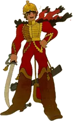

Régen volt már buszos történet, pedig van miből meríteni. Ma például a magyar őstulok egyik korosodó példányával sikerült összefutni, aki nemzeti szallagos, lúdtollas kalpagba, kitüntetésekkel meg ilyenekkel várta a pesti buszt.

Közben hangosan ordibált, hogy "most már aztán igazán vége ezeknek a zsidó kommunistáknak", és egyébként is ilyen-olyan kutyák meg én nem tudom még mi. Valaki szólt neki, hogy nem érti miért kell ezt ilyen hangosan. Na onnantól fogva rátért ez a jóember, hogy a néni bizonyos testrésze odáig szaglik ahol áll, és hogy milyen g\*cit kellene neki besz\*pnia és hogyan. És nevetett közben ez az igaz magyar ember a lúdtollas kucsmája alatt, és a miheztartás végett még hozzátette, hogy az ő családjában Rendőr Őrmester is akad. (És, hogy királok remegnek meg, ha csak kinyitja a száját.)

Komolyan mondom kedvem támadt csak öt percig elmerengeni ezzel az istenbarmával, hogy ne is menjünk messzire, kettőnk közül ki a nagyobb kommunista. Ki félemlíti meg az embereket, ki fenyeget bebörtönzéssel olyanokat, akik nem tetszenek neki. Vagy ha csak egy fél percig belegondolna, hogy mi lenne a magafajta tanulatlan, hasznavehetetlen, részeg disznóval, ha mondjuk egyik napról a másikra eltörölnénk a nyugdíjat, meg a társadalombiztosítást, ahogy egyébként a szélsőségesen antiszocialista szemlélet diktálja. De ám legyen, akkor csináljuk rendesen: bízzuk a piacra. Természetesen valaki felfedezné azt a kis értéket, ami az ilyen surmókok ingatlanjában akad, és életjáradékért cserébe rátenné a kezét a tanyájára. Aztán úgy 5-6 év múlva természetesen az utcára kerülne a Vitéz Címzetes úr, s mivel menhelyek meg hasonlók sem lennének akkor már, végül éhen is halna, ami a piac érdeke ugyebár. Na ezt szeretné ő pillanatnyilag.

Kérdem én: nórmális? A mai nyugdíjasnak abban kéne reménykednie, hogy a politikai elit még sokáig ilyen tehetelen marad. Ezen kívül természetesen erősen készülnie kellene a jövőre, amikor is majd az ősparaszt f�szfej kívánságának megfelelően eltakarodnak ezek a "kommunista disznók", és a másik oldal nagyon megerősödik.

Persze egyes magyarok inkább leakasztják a szögről az ünnepi subát a karikás ostorral és elmennek tojást dobálni a nemzeti ünnepen, hadd legyen mindenkinek egy újabb szép emléke.

* * *

Nem nem politizálok. Ha politizálnék, azt mondanám, hogy nekem mindegy, hogy melyik banda van hatalmon, egyikre sincs szükségem.
