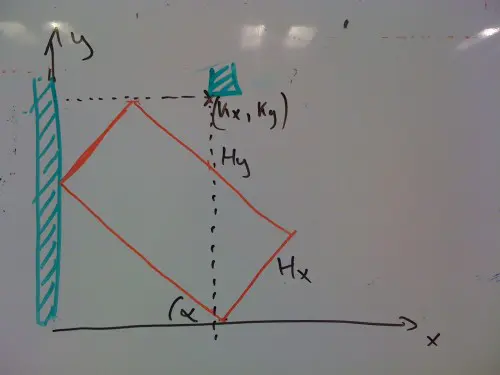
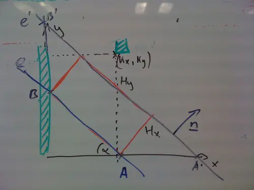

Vettünk hűtőt, egy élmény volt... Végigjártuk az összes boltot, kiválasztottuk a jót, aztán a neten kikerestük a legolcsóbb helyet és [megrendeltük](http://konyhabolt.hu). Eddig jól is ment, csak a kiszállítás volt szar, mert nem tudták megmondani, hogy melyik nap hozzák majd, csak előtte este hét és nyolc között. Aztán vegyél ki szabadságot másnapra... Majd biztos jön valami buzgómócsing megint, aki szerint ez így kurva jó, de engem akkor is idegesít.

Hétfőn beszéltem a sofőrrel, jól elmagyaráztam neki, hogy melyik utcát írja be a GPS-be, nehogy elkavarodjon, ugyanis a széleskörben használt GPS-es térképek nem tudják, hogy a mi utcánk zsákutca, és a rossz irányból próbálják  megközelíteni. (Az ilyenek Érden általában járhatatlan földutat jelentenek.)

Naszóval elmondtam a józsinak, hogy mit csináljon, ha nem akar a susnyásban kikötni. Egy óra múlva hívott.

\- Uram, itt vagyok az erdő közepén, már nem fér el az autó az úton!

\- Forduljon vissza, és csinálja amit korábban megbeszéltünk.

\- Nem tudom merről jöttem.

Végül kikeveredett az aszfaltra úgy, hogy közben telefonon diktáltam neki, hogy merre menjen. Akkor meg azzal kezdett jönni, hogy ugye van otthon valaki férfiember, mert ő nem bírja el a hűtőt. Hát a f�szomat nem bírod el bazmeg, milyen szállítás ez már? Mondom neki, nincs otthon senki, csak a terhes asszony, de oldja meg valahogy, mert ez a munkája. Na ezek után lebaszta a ház elé az egészet. Dáviddal kellett hazamenni becipelni.

A hűtő elhelyezése volt a legmókásabb, ugyanis a kamra ajtaja (valójában nincs ajtaja, csak egy nyílás), naszóval az ajtó kicsit kisebb volt mint a hűtő. De nehogy azt gondolják ám, hogy nem számítottam erre előre... Már jóval korábban kikalkuláltam Mapleben azt a legnagyobb frigóméretet, ami még éppen bevihető egy kis ügyeskedéssel.

Az alábbi ábrából induljunk ki.

Ez egy oldalnézeti kép. A csíkozott rész jelöli a falat, a piros téglalap a hűtő, amit addig döntünk, amíg a legmagasabb pontja éppen a nyílás magasságába nem esik, ezután rátoljuk a kamra falára, majd elkezdjük a talpára állítani, miközben végig hozzáér a hátsó falhoz. A hűtő méretei $H_x$, $H_y$, a kamráé $K_x$, $K_y$. Egy adott pillanatban a helyzetet egy $\alpha$ szöggel jellemezhetjük. A kérdés az, hogy van-e olyan $\alpha$ a $[0,\pi/2]$ tartományban, amikor a $(K_x, K_y)$ pont a hűtő belsejébe kerül.

Egészítsük ki az ábrát az $A$ és $B$ pontokkal, az ezeken átmenő $e$ egyenessel. Toljuk el $e$-t $e'$-be, ami a hűtő külső oldalán fut végig, és vegyük fel a talajjal és a fallal alkotott metszéspontokba az $A', B'$ pontokat.

Kis trigonometrikus bűvészkedéssel:

$$\begin{aligned}
   A &= (H_y\cos\alpha, 0) \\
   B &= (0, H_y\sin\alpha)
\end{aligned}$$

valamint

$$\begin{aligned}
   A' &= (H_x\sin\alpha + H_y \cos\alpha, 0) \\
   B' &= (0, H_x\cos\alpha + H_y\sin\alpha)
\end{aligned}$$

Az $\overrightarrow{AB} = (-H_y \cos\alpha, H_y \sin\alpha)$ óramutató járása szerinti 90 fokos elforgatásával és a hosszával való osztás után kapjuk az egyenes normálvektorát: $\underline{n}=(\sin\alpha, \cos\alpha)$. Ezzel már felírhatjuk $e'$ normálvektoros egyenletét:

$$ n_x(x-A'_x)+n_y(y-A'_y) = 0 $$

Behelyettesitve a fentieket:

$$\tag{e'} x\sin\alpha-H_x-H_y\sin\alpha \cos\alpha + y\cos\alpha=0$$

Mivel az x és y együtthatójának négyzetösszege 1, az egyenlet bal oldalába helyettesítve a $(K_x, K_y)$ pont koordinátáit, éppen a pont és egyenes (előjeles) távolságát kapjuk. (Nem emlékszem hogy hívják az egyenesnek ezt a fajta egyenletét.)

Már csak azt kell kiderítenünk, hogy adott $K_x$, $K_y$, $H_x$, $H_y$ mellett minden $\alpha$ esetén igaz-e, hogy

$$K_x\sin\alpha-H_x-H_y\sin\alpha \cos\alpha + K_y\cos\alpha \geq 0$$

Sajnos a feladatot analitikus eszközökkel nem lehet megoldani (legalábbis nem sikerült), de megoldható Maple-ben numerikus módon.

Egész pontosan a kiválasztott hűtők paramétereivel megkerestem a távolság minimumát a $[0,\pi/2]$ tartományban és megnéztem, hogy pozitív-e.

A végeredmény szerint választottunk hűtőt és bár hihetetlen, de tényleg befért, még szenvedni sem kellett vele.

### Breaking

Megoldható a fenti csoda a tanges félszögekkel kapcsolatos azonosságok [felhasználásával](http://wj32.wordpress.com/2008/07/25/solving-simple-linear-trigonometric-equations-using-tangent-half-angle-formulae/). Ekkor egy negyedfokú egyenletre írható a fenti, onnan meg már...
