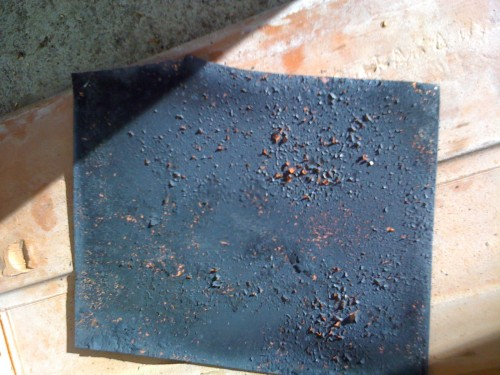
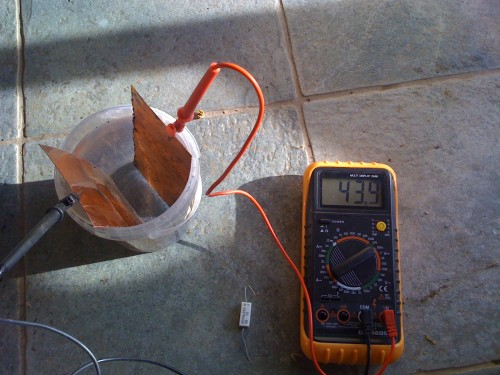

Villamosipari anyagismeretből azt a feladatot kaptuk, hogy válasszunk ki bármilyen az anyagismeret témájába vágó anyagot, és írjunk róla valamit. Elsőéves villamismérnök halgatóként a legmesszebbmenőkig elítélem ezt a feladatkiosztást, hiszen honnan a .... kéne nekem bármit tudni az anyagtudományról, meg arról, hogy mi vág a témájába. Meg is mondtam a tanárnak, hogy tőlem ne várjon érdekességeket, a napelemekről tudok írni, mert az viszonylag jól dokumentált mindenfelé a neten. De azért, hogy ne legyen túl száraz a dolog, és főleg, hogy én is élvezzem egy kicsit, megpróbálkozom itthon napelem készítésével.

Természetesen nem olyan napelemről van szó, ami használható is. Bőven megelégednék valamivel, amivel ki lehet mutatni a fotoelektromos jelenséget. A neten több helyen is utalnak a végül elvégzett [kísérletre](http://worldwatts.com/homemade_solar_cell/homemade_solar_cell.html).

### A jelenség

Azt szeretnénk kimutatni, hogy egy réz-I-oxid (Cu2O) lemez, fény hatására előszeretettel dobálja el az elektronjait. Ezek az elektronok egy elektrolitos oldatban (sós víz) átúsznak egy másik, sima rézlemezre. A két lemez között feszültség és természetesen némi áram mérhető.

### Anyag- és eszközbeszerzés

Rezet a munkahelyemhez legközelebbi bádogosnál vettem, ott elég hülyén néztek, amikor elmondtam, hogy nekem csak egy ilyen kis darabka réz kellene, és tényleg nem akarok belőle esőcsatornát építeni, csak egy házi feladat miatt kell. Végül nagy nehezen, és duzzogva levágtak egy arasznyi széles csíkot a 40 méteres rézgurigából. Még mondta is a bácsi, hogy a szélét levágja géppel egyenesre, de megegyeztünk, hogy erre semmi szükség, hiszen ezt én még úgyis tovább fogom darabolni egészen kis darabokra. Nagyot néztek amikor elmondtam, hogy napelemet fogok csinálni belőle.

A réz-I-oxid készítéséhez egy rezsóra van szükségünk, legalábbis a kísérlet leírása szerint, amitől nem akartam eltérni hacsak nem volt muszáj. Szereztem hát egy 1500W-os rezsót a neten. Nekem ne mondja senki, hogy nem készülök fel alaposan...

Jobb kint csinálni az ilyeneket, ki tudja milyen büdös lesz miatta. (Nem lett az.) Kivittem a rezsót, beállítottam max fokozatra, és jó fél órán keresztül hevítettem rajta a rezet, amin sötét réz-II-oxid réteg keletkezett. Ezt lassú hűtés után ütögetéssel, illetve simán az ujjam végighúzásával el lehetett távolítani, hogy alatta előtűnjön a vékony réz-I-oxid bevonat. A bejegyéshez csatolt képen amúgy ez a réz-I-oxid látszik kicsiben. A teljes kép [itt](https://csokavar.hu/wp-content/uploads/2010/11/ΙΚ1-1.jpg) érhető el, és [innen](http://galleryhip.com/copper-oxide-structure.html) származik.

### A kísérlet

Nem fűztem a dologhoz komoly reményeket, már azzal is ki lettem volna elégítve, ha bármilyen mérhető eredményre jutok. A kísérletet többször is meg kellett ismételni, mert legnagyobb sajnálatomra már a műszer tiszta vízbe mártott csatlakozói között is tudtam némi feszültséget mérni. (Ugyanez reprodukálható volt közönséges rézlemezek vízbemerítésével is.) Próbáltam desztillált vizet is szerezni, de több benzinkúton is csak ioncserélt vizet árultak. Végül egy olyan desztillált vízzel egyenértékűnek nevezett, kémiailag teljesen sómentesített víz mellett döntöttem, aminek a vezetése 20μS-nél kisebb volt. (Bár azt nem adták meg, hogy ezt pontosan hogyan lehetne kimutatni, én ennél jóval nagyobbat mértem.) Sajnos ez a víz is produkálta a mérhető feszültséget már akkor is, amikor tiszta pohárba öntöttem és a feszültségmérőt közvetlenül a víz két pontjára helyeztem. Ez kissé elgondolkodtatott, mert ugyan hogyan tudna már az a szerencsétlen tök homogén víz két pontja között bármilyen feszültséget produkálni, de mondjuk tudjuk ezt be a benne mikro szinten kavarogó ionoknak.

Összességében négy különböző alkalommal, és több elrendezésben is sikerült reprodukálni a jelenséget, és minden alkalommal nagyon szépen látszott, ahogy a berendezést letakarva csökken a feszültség ill az áramerősség.

Két réz-oxid lemezt, és 3 rézlemezt használtam el közben. Egyszer történt egy furcsaság, hogy vödörrel letakarva a rendszert, a feszültség elkezdett nőni (pedig csökkennie kellett volna...). Gyanítom azért, mert az egyik rézlemez időközben beszennyeződött, talán nem tett neki jót, hogy egy hétig a sós-vizes fürdő után hagytam száradni.

Ettől eltekintve a jelenség minden alkalommal szépen látszott, és végül mindent nulláról újrakezdve most már számokkal is alá tudom támasztani.

**1) Két 7.5x15 cm-es rézlemez, 3 kanálnyi sósvizes oldatba merítve:**

A köztük mérhető feszültség: <10 mV, időben lassan ingadozik (lemegy 0 alá, majd át a negatív tartományba, és vissza).

Áramerősség: kb -0.017 mA (ez is változik).

Megj: Az áramerősséget és a feszültséget nem tudtam azonos időpillanatban mérni. Az áramerősség méréséhez még sorba kötöttem a műszert egy 1Ω ellenállással is a biztonság kedvéért.

**2) A két lemez közül az egyiken réz-I-oxid réteget képezve, és visszahelyezve az oldatba.**

**Napra helyezve:**

feszültség: kb 40.6 mV,

áramerőség: kb 0.22 mA

****Sötétben** (egy vödörrel letakarva):**

feszültség: kb 0.86mV

áramerősség: kb 0.035mA

A számokból is látszik, hogy valóban nagy a változás a napra helyezett és a sötétben történt mérés között, valamint a napon jobb értékeket mérünk mint a két rézlemezes elrendezésben. Mindezek alátámasztják a jelenség létezését.

Mindössze 40.6\*0.22\*10^-6 W teljesítményt tudtam kisajtolni a dologból, ami nem nevezhető soknak. Egy izzólámpát sem lehet vele felvillantani.

Tényleg érdekes kísérlet, és nagyon látványos is, ha valaki szeret otthon kísérletezgetni, és megvannak az eszközei, csak ajánlani tudom. (Köszönet Mayának a multiméterért.)
