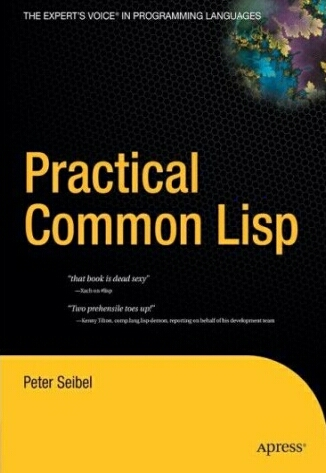

A héten befejeztem Peter Seibel Practical Common Lisp című könyvét, és továbbra is vegyes érzéseim vannak a nyelvvel kapcsolatban. A könyv egyébként nagyon jó, csak ajánlani tudom mindazoknak, akiket érdekel a Lisp és egy viszonylag széles merítést akarnak kapni belőle az alapoktól indulva, egészen egy egyszerű kis webes alkalmazás elkészítéséig, ami egyúttal shoutcast szerver, binárisból parsolja az ID3 tageket stb. Nagyon jól összerakott könyv 10/10, bár én tudnék ilyet írni valamikor... akármiről.

### Domain specifikus nyelvek

De vissza a vegyes érzelmekhez. Tulajdonképpen az egész nyelvben csak a makrók fogtak meg, ami nem is csoda laza 8 év domain specifikus nyelvek (DSL) terén szerzett tapasztalatomból kifolyólag. Na jó, ez így túlzás, de ha meg azt írom, hogy DSL alapú eszközök (domain workbenchek) fejlesztésére szolgáló eszköz fejlesztésében, az még durvábban hangzik, pedig hát ez az igazság, akárhogy nézzük is. A makrók nagy királyság, és már emiatt megérné a nyelvet nap mint nap használni, ugyanakkor én láttam ennél sokkal ígéretesebb megoldásokat ezen a téren.

Olyan eszközöket, amikben a DSL o_lvasható._ Igen, olvasható, mert mondjon nekem akárki akármit, a Lisp programok kurva nehezen olvashatók. Jó, a könyvben nincs syntax highlight, viszont van szöveges magyarázat. De még ezzel együtt is elgondolkozik az ember, hogy akkor ez itt most egy változó neve akar lenni, vagy talán inkább valami függvény, netán kulcsszó. És eleve mindent beleerőltetni ezekbe a zárójelekbe, kész gyötrelem. És tökéletesen tisztában vagyok vele, hogy John McCarthy az elején még tervezte a szintaxis kialakítását (amíg közbe nem jött a Beatles\*), és így, hogy nem kell parsolni, sokkal könnyebb a kódot adatként kezelni, de ez nekem még így is kevés. Köpjenek le, kérem, köpjenek le, és bizonyítsák be hogy nincs igazam.

Én olyan eszközöket szeretnék, ahol definiálom a DSL-t valami egyszerű kis nyelven, ami mondjuk olyasmi lehet, mint ahogy az ember egy xml sémát definiál. Aztán adok hozzá valami projekciót (akár többet is), ami meg az xml analógiát folytatva, egy xsl transzformáció a DSL-ről valami layout nyelvre. Írok hozzá pár sorban egy generátort DSL → C# vagy akármi, ami szemantikát ad az egészhez. És ennyi, megkapom az editort. Nem írtam parsert, de jól néz ki a képernyőn a DSL-ben írt "program". Világos, hogy mi kulcsszó és mi nem. Rendesen van tördelve, az általam használt, ismert és szertett jelölésrendszert látom magam előtt. Úgy általában pont úgy néz ki az egész, ahogy papíron a legkényelmesebben le tudnám írni. Nem is biztos hogy szöveg alapú... lehet, hogy egy táblázat jobban megfelel, vagy valami gráf, ahol összehuzigálom a dolgokat. Ki tudja...

És igen, akarok hozzá code completiont kapni, és refactoring toolokat is, meg "find references"-t, és az összes kis feature-t, amit egy IDE-ben megszoktam programozási nyelvek kapcsán. Ja, hogy a DSL-em nem programozási nyelvekről szól, hanem adószabályokról, pénzügyi döntésekről, logisztikáról, akármiről... annál inkább.

Hiányoznak ezek az eszközök mint egy falat kenyér, és sajnos a Lisp nem adja meg a kívánt szabadságot, bár kétség kívül nagyon erős a maga kis világában.

### Dinamikus nyelvek

A másik dolog ami miatt nem kedvelem a Lispet az a típusok hiánya. Van most egy vicc a cégben, hogy hidd el nekem, hogy te már nagyon öreg programozó vagy, mert még mindig a szigorú statikus típusosságban hiszel, és nem ismered el a manapság divatos dinamókus nyelvek létjogosultságát. (Természetesen ilyenkor átsiklunk afölött, hogy a Lisp egyike az ős nyelveknek.) Az utóbbi évtizedben egyre-másra jönnek fel a dinamikus nyelvek, és én és a barátaim közül sokan nagyon nem értjük ezeket az újhullámos kis nyikhajokat a rapid prototyping-al meg a test driven developing-al, valahogy úgy tűnik, hogy nagyon hiányzik valami, ha pl. az IDE nem tudja nekem megmondani, hogy egy adott változóval mit lehet csinálni. Sokakat ez egyáltalán nem zavar, és ilyenkor tényleg úgy érzem, hogy én már egy vén f�sz vagyok és nem értek semmit. De amikor a Lisp könyv végén arról olvasok, hogy jó ez a nyelv, na de hol van teljesítményben egy C-hez képest, és aztán elkezdi declare-ekkel teleszórni a kódot, hogy futás idejű ellenőrzéseket kapcsoljon ki annak érdekében, hogy mondjuk egy összeadás csak int-ekre működjön, és túl tudjon csordulni (ahogy C-ben), akkor azért csak nagyon nehezen tudom elnyomni a kis félmosolyt, hogy lám-lám a nagy öreg hogy küzd a típus kalkulus hiánya miatt. De megint megkérem Önöket, hogy rakjanak helyre, ha tudnak.

Összességében. A könyv nagy kaland volt, tetszett, rengeteg ideig tartott napi húsz oldal sebességgel a buszon elolvasni, de megérte, mert sokat tanultam belőle. Még akkor is, ha nem tervezem, hogy Lisp programozóként folytassam karrieremet.
