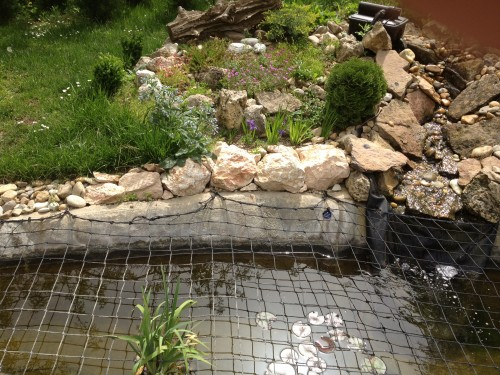
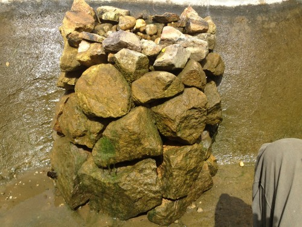
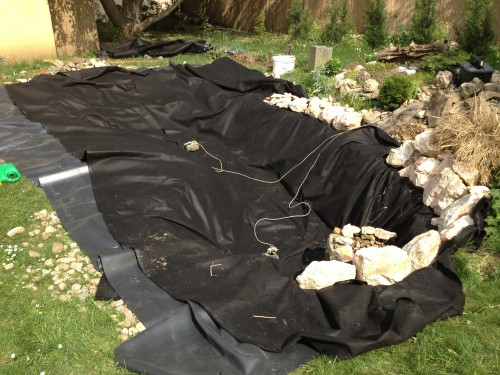
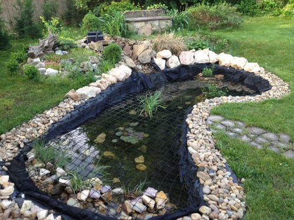

A tavat már a házzal együtt vettem, és ha már megvolt, nem akartam betemetni. Elolvastam egy csomó egymásnak részben ellentmondó leírást, mindenfélét kipróbáltam, jó csomó pénzt beleöltünk, és talán-talán most már működőképes állapotba került, de ki tudja mit hoz a jövő.

> Legfontosabb tanácsom: ha felmerül, hogy megtartsunk-e egy ilyen tavat még mielőtt költenénk rá, de amúgy nem életünk álma egy tó, akkor gyorsan temessük be. Mindenki jól jár vele.

Az előző tulajdonos kibetonozott egy kis részt hátul a diófa alatt. Elmondta, hogy télen egy kis csobogót hagyjunk a vízben, hogy ne fagyjon be teljesen és jusson oxigén a halaknak. Tavasszal ürítsük ki, csak egy kis iszapot hagyjunk az alján.

Egyszerűnek hangzott. Azt gondoltuk, hogy a kis iszapba teszünk majd növényeket, és attól egy idő után kitisztul majd a víz. Persze nem tisztult ki, úgyhogy vettünk egy UV-s vízszűrőt, amitől picit javult a helyzet, de igazából az sem segített. Vannak ilyen egymásnak részben ellentmondó okosságok, hogy a tó legyen árnyékos helyen, de ne legyen fa alatt, mert a belepotyogó levél nem tesz jót neki. Nekünk egy nagy fa volt a tó fölött, ami több ok miatt sem tetszett, úgyhogy megszabadultunk tőle, így most nincs árnyék, viszont a levelek sem potyognak a vízbe. Mondanom se kell, hogy ez sem vált be.

A másik vonalon elindulva a kisgyerekek miatt kénytelenek voltunk biztonsági hálót tetetni a víz fölé. Ez jól működik, már mindkét gyerek kipróbálta, és tényleg a víz fölött tartotta őket. A tó élvezeti értékéből persze sokat levon, de eredetileg se voltak illúzióim. A [hálót](http://www.medencebiztonsag.hu/home/) egy kedves bácsi szerelte fel, nyugodtan ajánlhatom. Nem olcsó, de szerintem megéri, már két telet kibírt, eddig semmi gond nem volt vele.

Tavaly aztán megelégeltem a vízproblémát és felhívtam [Domokos Balázs kertészt](http://www.kertstudio.hu/), aki helyrekalapálta a dolgokat. Először is elmondta, hogy a vízszűrő szivattyú teljesítménye kicsi, és hogy ő az Oase termékekre esküszik, amit ugyanaz a cég gyárt, ami a barkácsboltokban kapható Pontec termékeket, de ez a család már a professzionálisabb vonalat képviseli. Az UV-C szűrővel nem volt gondja, abból jót vettünk eredetileg is. Nem tudom a pontos típust, de valami [ilyesmire](http://www.gardenwebshop.hu/?mod=termeklap&id=9027) gondolok. A víz egy UV-C lámpát tartalmazó kis dobozba érkezik, aztán átfolyik három különböző szemcseméretű szűrő szivacson, és onnan vissza a tóba. Ebből építhetünk kis vízesést is. Ha valakinek nem tetszik a fekete doboz, akkor kiélheti barkácsszenvedélyét, és építhet köré valami kis házikót vagy hasonlót.

Karbantartása nem nehéz, kéthetente pucoljuk a szivacsokat, és tavasszal veszünk bele egy izzót. Érdemes már az elején kipróbálni, hogy fogjuk jövőre betenni az izzót, mert egy év alatt hajlamos összegyógyulni az egész tok, és aztán törik az izzót védő kvarcüveg... Én persze rögtön a legelején eltörtem, és csak a szintén nagyon kedves [koi-farmos néninek](http://www.koi-farm.hu/) köszönhetem, aki egy másik termékből vette ki az üveget nekem, hogy nem ütött meg a guta ott helyben. Azóta is tőle veszem az UV-C izzót. Amúgy ezzel kapcsolatban is megnyugtattak, hogy a [márkásat kell venni](http://www.koi-farm.hu/index.php?page=shop.product_details&flypage=vmj_color_plus.tpl&product_id=780&category_id=23&option=com_virtuemart&Itemid=32) és kész. Valóban: megvettem a legolcsóbbat belőle, de az nem használt. Az UV-C izzóban amúgy az a legjobb, hogy nem szabad belenézni, tehát nem tudjuk, hogy működik-e. A szűrőn van egy kontroll LED, azt nézegethetjük, de egy szezont kibír folyamatos működés közben. (Bár olyat is hallottam, hogy az élettartama vége felé, már nem olyan hatásos, ezt megerősíteni nem tudom.) Asszem szárazon nem szeret világítani, bár ezzel kapcsolatban csak homályos emlékeim vannak. Engedjünk rá vizet, nehogy túlmelegedjen. Egyetlen dolog miatt kell néha szétszedni: a vízkő megtelepszik az üvegen, és akkor már hiába világít az izzó odabent. Kis ecettel hamar eltávolítható a probléma. Én nyaranta egyszer szedem így szét, de nyilván vize válogatja.

Visszakanyarodva: a szűrés tehát jó volt, de kellett egy nagyobb teljesítményű szivattyú. A szivattyúval kapcsolatban annyit tanultam meg, hogy ha azt látom, hogy valami x liter/óra teljesítményű, azt úgy kell érteni, hogy abban az esetben, ha a cső vízszintesen fekszik. Tehát ha emelni is akarjuk a vizet, márpedig akarjuk, akkor olyat vegyünk ami ezzel is elboldogul.

Az UV szűrő persze nem elég, mert a fonalas algát nem öli meg, ami akkor jön elő ha túl sok fényt kap a víz. Erre a [rezezőt](http://www.kertitotechnika.hu/kertito_termek/velda_i-tronic_algairto_it-15_126655) javasolta a kertész, és tényleg működik a dolog. Mondjuk a rezezővel egy mondatban azt is fontosnak találta megjegyezni, hogy _soha semmi probléma nem volt vele_, és valóban, ahogy utánaolvastam, a túl sok réz nem csak az algát irtja ki a vízben, hanem a halakat is. Ezt mondjuk pont nem szúrtuk el, de azért leírom a rend kedvéért mint lehetséges buktatót. Persze a rezezőnek is kell egy szivattyú, de szerencsére erre a célra fel tudták használni azt, ami korábban az UV szűrőt táplálta. Ezt is kell tamagocsiztatni, néha drótkefével átkefélem a réz katódot, amikor kéri, és persze ebben is van fogyó alkatrész, amit 1-2 évente pótolni kell. A biztonság kedvéért úgy döntöttem, hogy évente fogom cserélni, mert ezen aztán igazán nem fogok elcsúszni, ráadásul márciusban akciós volt a réz anód a [koi farmnál](http://www.koi-farm.hu/index.php?page=shop.product_details&flypage=vmj_color_plus.tpl&product_id=365&category_id=72&option=com_virtuemart&Itemid=32).

A fő probléma az iszap volt a tó alján. Ugye az volt az egyik alapvetés, hogy iszap kell az aljára. Na ez nem igaz. A legfontosabb dolog a kerti tóban, ahogy a kertész mondta, hogy a szerves anyagot tartsuk tőle távol. Ne essen bele levél, fűszál, és ne folyjon bele föld, meg ami benne van. Tehát az egész tavat kiürítették, gőzborotvával lemosták. A növényeknek nagyon jópofa kis ültető kosarakat készítettek sziklából, a közepén kaviccsal. A víz közepén volt egy kis csobogó, amit én egy a ház körül kallódó műanyag doboz tetejére raktam rá, ők viszont megfordították a dobozt, megtöltötték kövekkel, és ebbe ültették a csobogó szivattyú részét. Ez tök jó ötletnek bizonyult, mert a kövek kicsit megszűrték a vizet, úgyhogy ritkábban kellett tisztítani az egészet. Most tavaszra mondjuk pont tönkre ment, bár az is igaz, hogy télen-nyáron használtam három évig. De nem vettem újat, inkább majd télire valami vízmelegítőt.

A növényeket cserépben tegyük a vízbe, a cserép tetejére pedig kavicsréteg kerüljön ezzel is elejét vesszük a koszolódásnak.

A következő probléma az volt, hogy a beton megrepedt, és a víz szivárogni kezdett. Sajnos a gőzborotvával kimosták a szilikon szigetelést a repedésekből, úgyhogy le kellett engedni újra és kiszilikonozni megint. Tavaly jó is volt, de idén persze megint tönkre ment... Itt már kábé ötvenedjére gondoltam, hogy betemetem az egészet a \*csába, de ilyenkor már inkább veszteségminimalizálásra megy az ember, úgyhogy vettem két réteg [geotextilt](http://www.suni-kft.hu/webshop/c95/geotextilia) (200g/nm), és egy réteg [EPDM gumi 1mm](http://www.suni-kft.hu/webshop/category/kertito_toepitesi_kellekek_tofolia,_geotextilia)\-es fóliát is. Szétszedtük a tavat, kipakoltuk a széléről és a mederből a sziklákat. Aztán egy réteg geotextil, egy réteg fólia és újabb réteg geotextil következett. Visszaépítettünk mindent, kifúrtam a geotextilt meg a fóliát ahol a biztonsági háló cölöpjei vannak, már éppen felraktam a hálót, amikor a kertész arra járt, és még időben megkérdeztem tőle, hogy mennyire szívja meg magát a geotextil (szemre nem látszott, mert éjszaka esett az eső). Na igen, azt vissza kell hajtani, különben kiszívja a vizet a partra. Tehát a rétegrend: geotextil, fólia és utána csak annyi geotextil, ami még a mederben marad. Na most, hogy a vízben úszó geotextillel mi lesz, az még a jövő zenéje. Egyelőre kövekkel lefogattam az aljára, sajnos még nem sikerült teljesen, de talán beválik.

Na itt állunk most. Tudom, tudom, tök jó lenne, ha a randa fekete izét eltakarná valami növény. Még nem szabad bekapcsolni az UV szűrőt meg a rezezőt, mert friss vízzel való feltöltés után két hétig érnie kell és állítólag bele kéne rakni egy kis tóindító baktérium mixet is, de az éppen nem volt itthon.

Komolyan mondom gondolják át, hogy akarnak-e tavat, de ha tényleg elkerülhetetlen olvassák át ezt a leírást, és kerüljék el a buktatókat.
