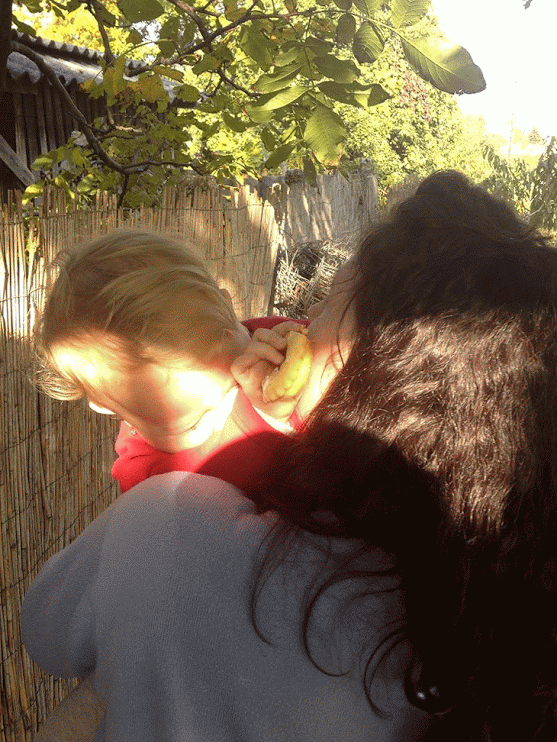

Tegnap voltunk Csanakon, csináltam képeket mindkét gyerekről. Itt van mindjárt Zsófi:

A képen dédi mellett a kutya is látható. Nálunk a kutyát mindig Talpasnak hívják, ami még az unokatesóim öreg dalmatájáról eredeztethető. Ez a kutya amúgy mindenhová elkíséri dédit,  volt, hogy a misére is bement, ilyenkor pironkodva kellett kivezetni. Máskor meg a templomot kezdte őrizni, és nem engedte be a népet ájtatoskodni. Bár erről már talán írtam korábban is.

Zsófi amúgy abban a hintában ül, amit még a papám hegesztett. Igazából arra kell rádöbbennem, hogy ezen a helyen minden négyzetméterhez fűződik valami történet. Például a hinta jobb oldalában évekig darazsak laktak, egész addig, amíg öcsémmel tele nem pakoltuk a csövet kavicsokkal. És rémlik még, hogy valami fadarabbal le is dugóztuk a tetejét.

Aztán, ez az a hinta, ahol a felhúzódzkodást gyakorololtuk. És én is meg tudtam azt csinálni, hogy a földről lendítve fel a lábamat függőlegesbe, aztán hátrafelé átfordultam a csövön. Ma már biztos nem menne.

A hinta mögött, ribizli bokrok vannak a kerítés tövében. A háttérben valamennyire látszanak is. Amióta az eszemet tudom, mindig ott voltak azok a bokrok. Három éves koromban itt vesztettem el a frankó kis játék horgászbotomat, amihez kis műanyag halak is voltak. És azóta is ha hátramegyek eszembe jut, és mindig lepillantok a földre hátha meglátom, hogy kiáll valahonnan a vége... De hiába :(

Ha kicsit jobbra fordulnánk, akkor a traktorkerékből készült homokozót látnánk. Bár tegnap nem csináltam róla képet, 2006-ban viszont videót is. Bár itt a homokozó csak háttérként funkcionál a sokkal izgalmasabb eseményekhez. Hoppá, és én is látható vagyok egy pillanatra.

http://www.youtube.com/watch?v=DoiuY6K6vy4

Aztán, ez az a hely, ahol megfordítottuk Józsi bácsi szőlőt hirdető kis tábláját. Biztos nem örült neki, dehát mi már csak ilyen csibész gyerekek vagyunk így harminc évesen is.

A jó öreg Józsi bácsinak egyébként hatalmas kertje van, és hatalmas teherbírása. Régebben hajnalban kelt, és állandóan piacozott. Persze mostanra már ő is 84 éves, de azért mikor pár éve találkoztam vele, még mindig nagyon korrekten rendbe volt téve a kertje. Úgy 10 éve dolgoztunk együtt legutóbb, valami gödröt kellett kiásni. Hát mit ne mondjak, nem ő fáradt el hamarabb. Az ilyen aknász munka nem programozónak való, de Józsi bácsi elég jól nyomta 70+ évesen.

A kapu. A kapu tetején ültem egész gyerekkoromban. A helikopteres (Panni szerint Helló kitter) kép jobb oldalán is látszik milyen frankó kis létrán lehetett felmászni a kaput tartó terméskőből kirakott oszlopok tetjére, és onnan órákig nézni a trabantokat, ladákat és hasonlókat, amiket akkoriban már a hangjukról felismertünk.

Azonban most ugorjunk hátra a diófához, avagy forduljunk kilencven fokot balra a hintás képhez képes. Hoppá itt van Panni baba.

Naná, hogy finom összeragasztós sütit eszik éppen.

Balra a tyúkudvar, ahova még gyerekkoromban vezettem be az áramot, és azóta is arról a vezetékről megy a világítás. A tyúkudvarban egyébként hihetetlen mennyiségű szart túrtunk és lapátoltunk miközben nyúlketreceket építettünk, fát aprítottunk, vagy éppen halmoztunk fel nagy kupacokba (tegnap is). Esetleg kukoricát hordtunk, vagy éppen hozzánk képest nagyságrendileg nagyobb szénabálákat mozgattunk arrébb. A szín tetejére fel is lehetett mászni, és egyszer frankón eltörtük az egyik hullámpalát, ami azóta is csálé.

Itt öltük a pipiket ebédre, és erről is írtam már egy rövidet korábban, amikor a túlzott szexuális aktivitás hátrányait ecseteltem. Az egyszeri sánta tyúkot ugyanis annyira sajnálta a dédi, amiért a kakas állandóan megtalálja, hogy inkább levest főzött belőle daragaluskával. Erre varrjanak gombot.

A tyúkudvarról most persze nem csináltam képet, mert nem tudtam, hogy erről fogok írni, de szerencsére találtam még egy frankó kis pom bear ölős videót, aminek ez áll a középpontjában. Jó hogy ezeket a konzervanyagokat még nem lőttem el idáig. Alapvetően 101-et akartunk belőle forgatni, de hamar elfogyott a chips, meg az ötletek is ellaposodtak. Végül is mi a túró történhet _még_ egy nyamvadt kis medvével.

http://www.youtube.com/watch?v=So1QIE2Bs18

Van még egy ilyen remek videó, úgyhogy azt is elmondom, hogy a ház tövében van egy hatalmas vaskád, ebben esővíz gyűlik. Régebben egy nagy vas(?)hordó volt itt, valamikor 20 éve ástuk csak le ezt a kádat. A hordóban vágtam tönkre az első órámat, mert elfelejtettem levenni mielőtt belemásztam. Emlékszem, hogy a Willy Fog volt a tévében, amikor apu elkezdte szárítani, de sajnos menthetetlen volt. Pedig milyen szép kék kis óra volt.

Érdekes, hogy az elektronikus cuccok nálunk mindig folyadék általi halált halnak. Apu egyszer vodkával végezte ki a mobilját, a másikat meg talán beejtette a WC-be. Bár ez utóbbiban nem vagyok teljesen biztos. Na de visszakanyarodva a véres belezéshez, amire mindannyian kíváncsiak. Íme:

http://www.youtube.com/watch?v=TiJPNM6BKQ4
