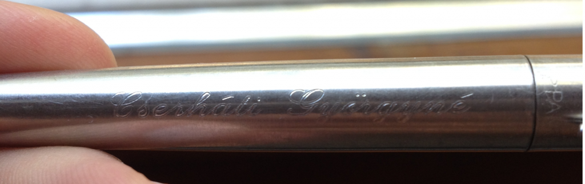

Még nem meséltem el, hogy kerültem át Flopside-ra. Illetve, arra már én sem pontosan emlékszem, hogy történt az átkerülés, de határozott jelek mutatnak arra, hogy igenis kifordult valami. Talán akkor történt, amikor a fodrász a másik oldalra [fésülte](https://csokavar.hu/blog/2007/11/ize/) az akkor még hoszú és lobogó hajamat. Már akkor alig találtam haza, lehet valami varázsfésűje volt, vagy én nem tudom. Lényeg a lényeg, először azt vettem észre, hogy a valamelyik karácsonyra kapott gravírozott Parker tollamon a nevem valahogy átváltozott Cserháti Györgynére. Pont ma került a kezembe, most ilyen. Kicsit olyan ez nekem, mint a pörgettyű az [Eredetben](http://www.imdb.com/title/tt1375666/).

Fura hely ez, szinte minden nap megállapítom. Vannak viccesen fura dolgok, mint például Ramanujan eredményei, vagy a számítástudomány Linuxa, a Turing gép, ami jószerivel minden szaron elfut a [Conway játékoktól](http://rendell-attic.org/gol/tm.htm) a diofantikus egyenletekig. Ez utóbbiról egyébként, ha még nem tették, mindenképp olvassák el Gregory Chaitin Meta Math!: The Quest for Omega című [könyvét](http://www.amazon.com/Meta-Math-The-Quest-Omega/dp/1400077974), nekem Maya adta a kezembe, egy állatság, de jó értelemben.

Aztán itt van a [Coursera](https://www.coursera.org/). Ki a fenének áll érdekében, hogy tök ingyen színvonalas kurzusokat csináljon mindenféle témában, jónevű egyetemek tanáraival? Nem sikerült rájönnöm az üzleti modellre, jó, jó vannak fizetős kurzusok, vagy legalábbis vizsgák, ahol ellenőrzik a személyazonosságodat is, de ha egyszer ingyen lehet jóságot tanulni miért akarna valaki fizetni is érte?

Elvégeztem a [Cryptography I-et](https://www.coursera.org/course/crypto) a Stanford Egyetem gondozásában. Sok újdonság volt benne, mert nekem az egyetemen kimaradt a diszkrét matek sáv. Most már legalább végignéztem és jegyzeteltem jó 15-20 órányi anyagot, ami a biztonságos véletlenszámgenerálástól a publikus kulcsú titkosításig tart. Februárban folytatjuk a második félévvel, és tervben van egy harmadik félév talán egy év múlva, ami már abszolút a jelenlegi kutatási eredményekről fog szólni.

Megtanultam használni néhány módszert, amiről eddig csak sejtéseim voltak. De az igazán élvezetes a szorgalmi feladatok leprogramozása volt. Minden hétre jutott egy. Először azt tanultuk meg, hogy mennyire rossz ötlet a one-time pad kulcsát többször használni. Ha ugyanis ugyanazzal a bitsorozattal xorolsz végig több mint egy szöveget, akkor csak a ciphertextek vizsgálatából kikövetkeztethető a kulcs, és így a következő üzenetet már meg tudod fejteni.

Aztán volt még padding oracle támadásra is egy jó példa. Egy webszervernek küldött titkosított URL paramétert kellett bájtonként visszafejteni. A módszer azért működik, mert a webszervert rosszul programozták, és más választ ad abban az esetben, ha a neki küldött paraméter decryptálása után rossz a nyílt szöveg végére írt padding, illetve akkor, ha a padding jó, csak aztán a nyílt szöveggel nem tud mit kezdeni (rossz kérdést tettünk fel neki). Ezt a hibát és az AES CBC módjának működését kihasználva néhány pillanat alatt vissza tudtunk fejteni egy titkosított query paramétert.

Ha most azt gondolják, hogy ez valami elméleti baromság, akkor elmondom, hogy a módszert eredetileg email jelszavak megszerzésére használták (az IMAP protokol sajátosságait és a TLS kezdeti hibás implementációit kihasználva). A kurzus amúgy tele van gyakorlatban elkövetett baklövések esettanulmányaival, és abszolút a mindennapi életben használható tudást ad.

A másik szintén teljesen flopside élmény nagy $N$-ek faktorizálásáról szólt. Ugyanis ha $N=pq$ alkalmas prímekkel, ahol ezek a prímek közel vannak egymáshoz, akkor egész könnyen meg tudjuk őket találni. A feltétel szerint 

$$|p - q| \lt 2 N^{1/4}\quad\quad(*)$$

Figyeljük meg, hogy az _elég közel_ mondjuk egy $4096$ bites $N$ esetén azt jelenti, hogy $p$ és $q$ távolsága nagyjából $2^{1025}$ is lehet.

Lényeg a lényeg, belátható, hogy ebben az esetben $p$ és $q$ számtani közepe, nevezzük $A$-nak, nagyon közel esik $N$ négyzetgyökéhez. Egész pontosan $A - \sqrt{N} \lt 1$, azaz $A$ nem más mint $\sqrt{N}$ felső egész része.

$A$-t már csak azért is jó ötlet bevezetni, mert így felírhatjuk ismeretlenjeinket $p = A - x$ és $q = A + x$ alakban, valamilyen $x$ egész számmal.

Ekkor viszont $N = pq = (A-x)(A+x)$-ből $x$-et ki is lehet számolni: $x = \sqrt{A^2-N}$. Innen pedig már meg is vannak azok a huncut kis prímek.

Már csak az a kérdés, hogy miért vagyunk ilyen mázlisták $A$-val. Ehhez vizsgáljuk a következőt:

$$A^2 - N = \left({p+q \over 2}\right)^2 - N = {p^2+2N+q^2 \over 4} - N = {p^2-2N+q^2 \over 4} = {(p-q)^2 \over 4} $$

A kifejezés felfogható négyzetek különbségeként is, így bepattinthatjuk ide:

$$A - \sqrt{N} = (A - \sqrt{N}) {A + \sqrt{N} \over A + \sqrt{N}} = { A^2 - N \over A + \sqrt{N}} = { {(p-q)^2/4} \over A + \sqrt{N}}$$

A jobb oldal pozitív, tehát $\sqrt{N} \leq A$. Amit felhasználva:

$$A - \sqrt{N} \leq { {(p-q)^2/4} \over 2 \sqrt{N}} = {(p-q)^2 \over 8 \sqrt{N} }$$

A $p$ és $q$ távolságára tett $(*)$ kiindulási feltételünkből következik, hogy $(p-q)^2 \lt 4 \sqrt{N}$, így:

$$A - \sqrt{N} \leq { 4 \sqrt{N} \over 8 \sqrt{N}} = 1/2$$

Amivel be is láttuk amit szerettünk volna. Na persze nehogy azt higyjék, hogy erre egyedül kell rájönni. Mindent szépen leírtak, én is onnan ollóztam ide. Meg az is igaz, hogy ez volt talán az egyetlen matematikai bizonyítás, és ez is csak egy szorgalmi feladatban. Szóval megijedni nem kell, nagyon gyakorlatias az egész. Csak ajánlani tudom minden programozó ismerősömnek.

Visszakanyarodva a flopside élményekhez, Önöknek van valami ide vonatkozó érdekes matematikai tapasztalata?
