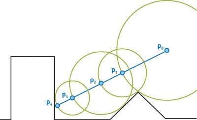

Gyerekkoromban rengeteg kisebb-nagyobb grafikai demót csináltunk Lukács haverommal PC-re. Persze ő mindig ügyesebb volt nálam, de azért én is összeraktam egy-két pörgő-forgó poliédert, mindenféle tűz effekteket meg plazmákat, Rubik kockát meg ilyesmit. Akkoriban még C-ben programoztunk, és assemblyben az igazán kritikus részeknél.

Emlékszem mennyi trükközés volt, hogy a szorzások számát csökkentsük. Például a2 - b2 helyett szorzattá alakítottuk a kifejezést, mert az (a-b)(a+b)-ben csak egy lebegőpontos szorzás van. Aztán áttértünk fixpont aritmetikára, és szorzás helyett ahol csak lehetett inkább shiftelgettünk.

Egy dolog viszont kimaradt: a ray tracing. Nemrégiben láttam redditen egy cikket, egy srác 35 sor JavaScriptben megírt egy ray tracert. Na gondoltam, itt a pillanat, ha ez tényleg ilyen egyszerű, most bepótolom a lemaradásomat.

Jött az év végi szabadság, és a feladat érdekesebb lett, mint gondoltam. Először megírtam a naív ray tracert JavaScriptben. Na persze nem 35 sorban, de legalább működik. Utána elkezdtem gondolkodni a gyorsításon. Egész évben pörgött az interneten az asm.js és emscripten téma, úgyhogy újraírtam az egészet C++-ban, és lefordítottam asm.js-re. Praktikusan semmit nem számított, viszont már maga az élmény, hogy C++ kódot futtatok a böngészőben megérte a fáradságot.

Utána jött Viktor a WebGL-lel meg a fragment shaderrel. Ez is egy viszonylag új dolog, amit eddig nem volt alkalmam kipróbálni, tehát beleástam magamat ebbe is. Böngészőben futtathatsz OpenGL programokat.  Készíthetsz például egy négyzetet két háromszögből és minden egyes (x,y) képpontra megmondhatod, milyen színűre szeretnéd kifesteni. Ez lehet valami vicces szinusz-koszinuszos függvény értéke, esetleg időben változtatva, animálva, vagy egy textúráról kiolvasott érték, vagy akár valami bonyolultabb számítás, mint esetünkben is. Ahelyett tehát, hogy a 3D megjelenítést az OpenGL-re bíznánk egyetlen négyzetet kérünk tőle, és mi számoljuk bele az egész képet.

Fragment shadert GLSL-ben lehet programozni. Ez egy C-nek látszó nyelv, csak még ahhoz képest is fapados. Tele van érthetetlen megszorításokkal például  az array-eket indexelni csak konstans kifejezésekkel vagy ciklusok futóváltozójával lehet.  A ciklusnál viszont meg kell mondanod, hogy melyik két konstans között mozogjon a ciklusváltozó, és így tovább.

Mivel az elmúlt hónapokban csak úgy röpködtek a closure-ök, promise-ok és hasonlók az irodában, képzelhetik mekkora élmény volt összekalapálni az alábbi kis szösszenetet. Kis hijján lefejeltem a monitort a fékezéstől.

[iframe src="https://csokavar.hu/projects/raymarch/spheres"]

Viszont működik, már amelyik böngésző támogatja a WebGL-t.

Nagyon zanzásítva elmondanám a ray tracinget, és utána azt is, hogy mit csináltam helyette. 3D megjelenítéskor a kamera egy gúlaként képzelhető el valahol a térben. A gúla alaplapjára vetített képet látjuk majd a képernyőn. _Ray tracing_ esetén a gúla felső csúcsából félegyeneseket húzunk az alaplap pontjain, a későbbi képpontokon át, és megnézzük, hogy a jelenet (scene) milyen objektumát találjuk el vele. Ennek az objektumnak a színéből, a lámpákhoz viszonyított helyzetéből, távolságából és láthatóságából, az ambiens fényből, tükröződésekből esetleg fénytörésből, textúrából számolhatjuk ki a képpont végleges színét.

Ez azt jelenti, hogy miután megvan a félegyenes metszéspontja az objektummal, a lámpák felé újabb félegyeneseket indítunk, ha tükröződést vagy fénytörést is számolunk, akkor a megtört valamint visszavert fénysugarat is egy-egy félegyenessel helyettesítjük, és rekurzívan haladunk tovább. 

A sok színinformációt aztán a Phong modellel alakítjuk konkrét színekké, ez az ambiens fényből, a beeső fény erősségéből, színéből és az objektum diffúz színéből valamint fényvisszaverő tulajdonságából (shininess) dolgozik.

Jó sok koordinátageometria kell hozzá, de szerencsére nem túl bonyolult (legalábbis gömbök meg síkok esetén). Viszont mint kiderült van egy egyszerűbb módszer is, a _ray marching_.

Ahelyett, hogy metszéspontokat számolunk, képzeljük el, hogy a félegyenes egy pontján ülünk. Nézzünk körül, és keressük meg a legközelebbi objektumot. Tegyük fel, hogy ez d távolságra van. Ekkor az egészen biztos, hogy ha d-t megyünk előre a félegyenesen, még nem ugrunk át semmit. Viszont az új pontban megint megcsinálhatjuk ezt a számolást, és így tovább mehetünk előre, egészen addig, amíg végül eltalálunk valamit. Az alábbi ábrán ([forrás](http://nopjia.blogspot.hu/2012/03/ray-marching-distance-fields-in-real.html)) látszik mire gondolok.

Bőven elég a távolságokat nézni, az meg egy jóval egyszerűbb. Emiatt persze még nem írtam volna át az egészet, ray marchingra, hiszen addigra már kiszámoltam a gömbökkel meg a síkkal vett metszéspontokat, de kiderült, hogy ezzel a módszerrel az árnyékokat is viszonylag olcsón szép átmenetessé varázsolhatjuk.

Valahogy azt kéne kitalálni, hogy a fényforrás hány százaléka látszik egy-egy pontból, mekkora részét takarja el a többi tágy. Erre nekem nem volt jobb ötletem minthogy véletlenszerűen a fényforrás különböző pontjaira sugarakat bocsássak, és megnézzem hány százalékuk ér oda és mennyi ütközik bele útközben valamibe.

Ray marchinggal viszont bevethetünk egy apró trükköt, ugyanis ha a fényforrás felé haladva útközben közel kerülünk egy testhez, akkor az a test kitakarja a fényforrás egy részét. Minél közelebb megyünk el mellette, annál nagyobb részét. Másrészről viszont, tudjuk mikor vagyunk közel valamihez, hiszen a távolság értékek ilyenkor lecsökkennek. Ezt felhasználva, természetesen ordas nagy hazugsággal, de felírhatunk egy összefüggést ami pár százalékkal csökkenti a fényforrás láthatóságát. Minél közelebb húzunk el egy test mellett annál erősebben.

Így már elég egyetlen félegyenest vizsgálni, és mégis lágyabb, átmenetesebb árnyékokat kapunk a bináris látszik/nem látszik helyett.

Nem akartam ezt a bejegyzést algoritmusokkal terhelni, de a fentieket részletesebben is elolvashatjuk az alábbi [dolgozatban](https://csokavar.hu/projects/raytrace/imm6392.pdf). Nem néztem végig az egészet, csak a fejezeteket meg az algoritmusokat, de sokat segített a megértésben. A dolgozat irányított fényforrásokkal számol, nekem meg fénygömbjeim vannak, de nem volt nehéz továbbfejleszteni az olvasottakat.
