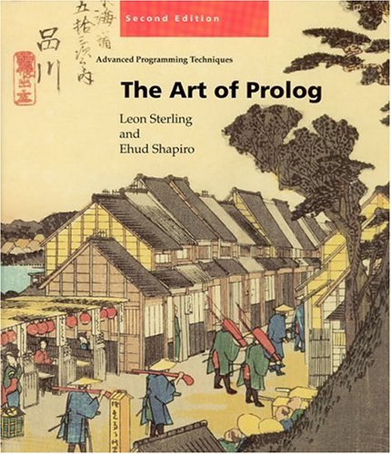

Amikor Ásványi tanár úr leosztályozta a második Prolog ZH-mat, mondott pár dolgot, aminek azóta sem néztem utána. Tudni illik nem tudtam a különbséget a zöld és piros vágás között. A ZH-ban meg piros vágásokat használtam, és ejnye-bejnye. ("De félre ne értsen nagyon jó dolgozatról van szó, csak...") Most azt már nem tudom, hogy konkrétan rossz is volt-e a megoldás, mindenesetre azt mondta a tanár úr, hogy nekünk ezt "nem szabad".

Ez aztán csak nem hagyott nyugodni az évek alatt, úgyhogy végül is megvettem a [The Art of Prolog](http://www.amazon.com/The-Art-Prolog-Second-Edition/dp/0262691639) című könyvet és végigtoltam az ősszel-télen. Érdekelt, mit lehet kihozni egy egyszerű backtrackből.



A Prolog ugyebár egy logikai programozási nyelv. Állításokat próbálunk levezetni kölönböző tényekből és következtetési szabályokból. A bizonyítás módszere az unifikálás, aminek során a logikai változók értéket kapnak, és a visszalépéses keresés. A vágásokkal jelezhetjük a Prolognak, hogy ha már egy részproblémát bebizonyított, tartson ki mellette, még ha később el is akad, ne menjen vissza és ne próbálja meg más úton újra belátni. Mint kiderült attól zöld egy vágás, hogy ki szabad törölni, nem változik tőle a megtalált megoldások halmaza, legfeljebb a keresés hatékonyságát csökkentjük vele.

A piros vágások törlésével viszont megváltozik az eredmény halmaz. Rossz eredményeket kapunk, vagy nem találunk meg valamit, mert esetleg egy végtelen ágat darálunk az idők végezetéig.

Hogy egy konkrétabb alkalmazást is mondjak, ami talán beindítja a fantáziát: a klasszikus ELIZA stílusú pszichiáter és páciens programok például egy végtelen sokféleképpen belátható predikátumban "futnak" úgymond. Na ha ezeket a programokat meg akarjuk állítani, akkor arra jó lehet egy vágás, ami szükségképpen piros lesz.

A Prolog ismertetésén túl több nagyobb program vázát is leírja a könyv. Találunk példát kétszemélyes játékokat játszó programokra (Nim, Mastermind, Kalah). Domain specifikus döntési algoritmusokra (adjon-e kölcsönt a bank az ügyfélnek). Egy középiskolai szintű egyenleteket megoldó programra, és egy kisebb Pascal-szerű programozási nyelv (PL) fordítójára a parsertől az assembly generálásig. Ezeknek tényleg csak a váza van meg, a fordítóprogram például függvényekkel már nem tud elbánni. Itt kicsit kevés volt a könyv, bár ha valakit érdekel, gondolatébresztőnek és kiindulópontnak jó.

Én mondjuk inkább agytornaként kezeltem az egészet. Mondtam is Zsófinak, hogy ez olyan mint az ő foglalkoztató füzetei, csak matricák nélkül. Könnyebb volt olvasni, mint a [Practical Common Lispet](https://csokavar.hu/blog/2011/10/practical-common-lisp/), főképp azért, mert lényegesen kevesebb programkonstrukciós eszközt kellett fejbentartani hozzá. A Lisp könyv végén, tekintve hogy nem volt szintax highlight, néha már rengeteg ideig tartott kitalálni, hogy egy-egy kifejezés mit is jelent. Na itt semmi ilyesmi nem volt. Ugyanakkor a könyv végére az lett az érzésem, hogy a Prolog nem alkalmas arra, hogy algoritmusokat adjunk át benne másoknak. Egészen a legutolsó oldalig nehéz volt megtalálni, hogy melyik változó hol kap értéket, és ettől, legalábbis nekem, nehezen követhető volt ez egész. Működik, működik, na de egy ilyenhez hozzányúlni... Persze lehet hogy csak én voltam kevés, vagy több feladatot kellett volna menet közben megoldani.

A legbonyolultabb, és tényleg új információ a difference listákkal kapcsolatos volt, mert eddig ilyenről nem hallottam. Prologban az unifikálás ügyes felhasználásával két listát konstans időben (egy unifikálással) össze lehet fűzni.

Magamtól valahogy így csinálnám. Az üres listához könnyű bármit fűzni:

```
append([], Ys, Ys).
```

Ha a lista nem üres, akkor előbb a farkát meg a másik listát összefűzzük `Zs`-be, aztán a fejéből meg `Zs`-ből megcsináljuk az eredményt `[X|Zs]`\-t.

```
append([X|Xs], Ys, [X|Zs]) :- append(Xs,Ys,Zs).
```

Ez így persze lassú, mert végig kell hozzá sétálni az első listán. De kiderül, hogy a listákat két lista különbségeként is felfoghatjuk. Például az `[1,2,3]` listára gondolhatunk úgy mint az `[1,2,3|E]` és az `E` listák különbségére, ahol `E` tök mindegy milyen lista. Ezt jelölésben `[1,2,3|E]\E` -nek írjuk. Az üres listát például tetszőleges `As`-sel írhatjuk `[As]\As` alakban. Ez a listák úgynevezett _különbségi reprezentációja_ (difference lists).

Namost amíg nem rögzítjük egy difference list farkát, addig elég könyű hozzácsapni egy másikat. Az `append_dl` definíciója:

```
append_dl(Xs\Ys, Ys\Zs, Xs\Zs).
```

Tegyük fel például, hogy O-t keressük:

```
?- append_dl([1,2,3|E]\E, [4,5|W]\W, O).
```

Mivel `E` és `[4,5|W]` egyesíthető, a Prolog futtató azonnal az `O = [1,2,3,4,5 |W]\W` eredményre jut.

Ezt persze eleinte nem hittem el, aztán egy fél órás bámulás után volt egy _Na elmentek a picsába_ élményem. Ha másért nem is ezért mindenképp megérte a könyv.  De érdekes volt a rengeteg metaprogramozás is. Prologban írt prolog interpreter, debugger, refaktoráló függvények és hasonlók. Homoiconicity (hogy a nap szavával éljek) rulez.

Összességében a könyvet matematikus lelkű olvasóknak ajánlom (helyenként fájóan precíz), akik szeretnek egy pár soros program működésén hosszan töprengeni. Természetesen tele a könyv feladatokkal, így jó szórakozás lehet egy unatkozó geek számára. Bár az is igaz, hogy annyi minden mással lehet foglalkozni... Mindenesetre mint történelmi nyelv és a mesterséges intelligencia, valamint természetes nyelvfeldolgozás kedvelt eszköze mindenképp olyan nyelvként kezelem, amivel egy magára valamit adó programozónak meg kell ismerkednie.
