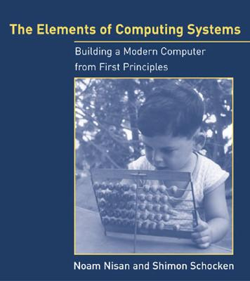

Múlt héten volt egy lélegzetvételnyi időm, és sikerült befejezni a [The Elements of Computing Systems](http://www.nand2tetris.org/) című könyvet. Régen volt a kezemben ilyen jó könyv. Bár igazából nem is az volt jó, hanem a mondanivalója. Mert hát melyik programozó ne szeretne legalább egyszer az életben egy saját számítógépet összerakni, egészen az alapoktól: NAND kapukból?

Messziről nézve teljesen valószínűtlen a feladat, mármint biztos meg lehet csinálni, de minimum egy emberélet kellene hozzá, hogy valameddig eljussunk. De kiderült, hogy mindössze öt fejezet (és kb 100 oldal) alatt összedobható az egész.

Előbb nyilván NOT, AND, OR, XOR kapukat építesz, meg ezeknek az egyszerre több bitet tudó verzióit, gondolok itt a több bemetet egyszerre és-elő kapura, meg arra, ami mondjuk 16 bites inputokból 16 bites outputot állít elő. Kell még multiplexer és demultiplexer, aztán rátérhetünk az összeadásra, negálásra és kivonásra. Nem ragozom, pikk-pakk összerakunk egy egyszerű ALU-t, aztán még egy kis memória kell, és már csak a CPU hiányzik, meg az egész összedrótozása.

Nagyon egyszerű processzorra gondoljunk, mindössze kétféle utasítása van, de az is bőven elég.

A fejezetek végén levő feladatok a fentiekhez hasonló áramkörök megépítését kérik. Nem rágják szájba a megoldást, gondolkodni kell, de éppen elég tippet kapunk ahhoz, hogy ne legyen megoldhatatlan a feladat, amit aztán a mellékelt tesztekkel többé-kevésbé ellenőrizhetünk is.

A perifériakezelést elhanyagolja a könyv, ezt én egy kicsit sajnáltam, mert így a végeredmény nem süthető egy az egyben FPGA-ra, de kis gondolkodással elvileg egy PS2-es billentyűzet és egy sima VGA monitor vezérlése megépíthető. Talán karácsony körül veszek egy [Papilio DUO](https://www.kickstarter.com/projects/13588168/papilio-duo-drag-and-drop-fpga-circuit-lab-for-mak)\-t, és azon be is fejezem majd, mert akkor végre egyben láthatom az egészet.

A második részben egy egyszerű programnyelvhez (Jack) kell compilert készíteni. Az első lépés természetesen egy assembler megírása lesz, ami nem túl komplikált, hiszen csak kétféle utasításról beszélünk. Ennek segítségével aztán egy kis virtuális gépet építünk, ez már ismeri a verem műveleteket és függvényhívást is. Csak ezután következik a Jack parsere és compilere.

Ha minden megvan, már csak egy kis libraryt kell implementálnunk Jack-ben. Ide kerül például a memóriakezelés (alloc, free), tömbök, stringek, sőt a bonyásabb matematikai műveletek (szorzás, osztás, gyökvonás) is. Van még szöveges be- és kimenet kezelés, valamint egy pici grafikus rajzoló API (pixelek, vonalak, körök, téglalapok).

Többfajta emulátort is kapunk, hogy menet közben ellenőrizhessük, kipróbálhassuk hol tartunk. Van olyan ami NAND kapukat tud emulálni, aztán ahogy egyre nagyobb dolgokat készítünk úgy jön be a CPU emulátor meg a virtuális gép emulátor is. Sajnos ezekre szükség is van, mert a végére olyan nagyra hízik az egész, hogy képtelenség lenne mindent NAND kapuktól emulálni (lassú lenne és végtelen sok memória kellene hozzá).

A könyv egy nagyon szép metszetet mutat be, utána tényleg úgy érzi magát az ember, mint aki csinált egy számítógépet (még ha nem is ő találta ki az arhitektúrát), és képes ezt olyan szinten leegyszerűsíteni, hogy mindössze néhány óra alatt végigcsinálható az egész. Szerintem nekem kb 30-40 órám ment rá, bár lehet hogy egy kicsit sokat is mondok ezzel. Teljesen érthető, hogy az ajánlás "To our parents, // For teaching us that less is more".

Amikor mindennel elkészültem, minden teszt gyönyörűen futott, már tényleg csak a végső próba volt hátra, így elindítottam a faltenisz tesztprogramot. Jól indult, aztán észrevettem, hogy a labda rossz szögben pattan vissza a falról. Na most képzelhetik azt a fejvakarást, amikor ott vannak a NAND kapuk a bemeneten, a kimeneten meg rosszul pattan a labda... (Jó, kicsit sarkítok, mert a készen kapott virtuális gépen futtattam, de akkor is). Végül kiderült, hogy az osztásnál elrontottam azt az esetet, amikor a számláló és a nevező is negatív. Na igen, ez is lejjebb van pár absztrakcióval.
